# OMD Valea Jiului — Specificație tehnică bază de date MySQL v1

**Aplicație:** OMD Valea Jiului – Sistem digital de marketing  
**Țintă:** MySQL 8.x / InnoDB / utf8mb4  
**Scop:** blueprint de proiectare DB pentru implementare backend în 3–4 săptămâni + stabilizare  
**Status:** design pregătit pentru handoff către programator / AI care va genera migrations, repositories și API  
**Fișier SQL asociat:** `MYSQL_SCHEMA_BLUEPRINT.sql`

## Surse analizate și ordinea de prioritate

1. `OMD-Valea-Jiului-prototip_external_json_v13_3(1).html`
2. `OMD_CAMPAIGNS_PACKAGE_SCHEMA_v1(1).json`
3. `OMD_CAMPAIGNS_PACKAGE_DEMO_SEED_v1(1).json`
4. `OMD_ACTIVATIONS_PACKAGE_SCHEMA_v1(1).json`
5. `OMD_ACTIVATIONS_PACKAGE_DEMO_SEED_v1(1).json`
6. `OMD_ACTIVATION_MONITORING_PACKAGE_SCHEMA_v1(1).json`
7. `OMD_ACTIVATION_MONITORING_PACKAGE_DEMO_SEED_v1(1).json`
8. `OMD_REPUTATION_MONITORING_PACKAGE_SCHEMA_v1(1).json`
9. `OMD_REPUTATION_MONITORING_PACKAGE_DEMO_SEED_v1(1).json`
10. `omd_import_packages_v1(1).js`
11. `EXTERNAL_JSON_IMPORT_REPORT_v13_3(1).md`
12. `DATA_PORTABILITY_REPORT(2).md`
13. `BACKEND_READINESS_REPORT(3).md`

Contractele JSON finale și modelul v13.3 au prioritate față de vechiul `OMD_DATA_PACKAGE`.


# A. Executive summary

Schema recomandată are **40 de tabele** și păstrează o separare clară între:

- **sistem / auth / audit / import**;
- **master data și strategie editabile de Admin**;
- **Campaign** și conținutul său;
- **assets** și template-uri;
- **Activation** și datele sale operaționale;
- **Plan anual**;
- **monitoring activări** ca istoric de snapshot-uri;
- **monitoring reputație** ca istoric independent.

Arhitectura finală este:

```text
Frontend
   ↓
Services / API
   ↓
Repository contracts
   ↓
MySQL 8.x
```

MySQL este **single source of truth**. JSON-urile rămân doar contracte de seed/import/export/interoperabilitate.

### Model hibrid

**Relațional** pentru:
- entități și identitate;
- relații care necesită FK;
- nomenclatoare;
- strategie;
- filtre și raportare;
- plan anual;
- assets;
- monitoring;
- audit/import batches.

**MySQL `JSON`** pentru:
- liste și blocuri creative de Campaign care sunt afișate ca bloc și nu necesită FK sau query granular în v1;
- de exemplu `secondaryMessages`, `storytellingDirections`, `applicationExamples`, `activationExamples`.

### Decizii structurale

- UUID intern DB: `CHAR(36)`.
- Identitate transportabilă: `external_key`.
- `external_key` este stabil și nu se schimbă în operațiile obișnuite.
- `Campaign`, `Activation`, `AnnualPlan` folosesc optimistic concurrency prin `version_number`.
- `Campaign`, `Activation`, `ActivationMaterial`, template-uri/assets relevante folosesc soft delete.
- nomenclatoarele și strategia se dezactivează prin `is_active`, nu se șterg.
- imaginile/base64 **nu** se stochează în MySQL; se decodează în filesystem/storage, DB păstrând metadata și relații.
- `ActivationMaterial.apiResults` dispare din modelul final; rezultatele sunt în `material_performance_snapshots`.
- `includeAnnualPlan` este doar instrucțiune de compatibilitate/import; source of truth final este `annual_plan_activations`. Dacă o activare inclusă în Plan se suprapune cu un an pentru care nu există încă `annual_plans`, planul acelui an se materializează automat (`external_key = anul ca text`), apoi se creează relația.
- `Campaign.products` și `Campaign.channels` rămân JSON descriptive, distincte de `product_catalog` și `channel_catalog`.
- datele demo nu se introduc prin migrations SQL; staging-ul se populează prin cele 4 `DEMO_SEED`.

### Medii

Se recomandă baze complet separate:

```text
omd_vj_staging
omd_vj_production
```

Aceleași migrations se aplică ambelor. Nu există `is_demo` pe tabelele business.

### Dimensiuni seed confirmate

- 6 campanii;
- 16 activări;
- 42 materiale;
- 15 template-uri de campanie;
- 8 assets vizuale cu base64 în seed;
- 2 înregistrări `annualPlans` explicite în JSON (2027 și 2028); după materializarea logicii `includeAnnualPlan`, staging-ul conține 3 `annual_plans` în DB: 2026, 2027 și 2028;
- 34 snapshot-uri de performanță;
- 1 snapshot de reputație;
- 4 piloni;
- 8 programe;
- 18 obiective.

Schema este intenționat suficient de normalizată pentru integritate și raportare, dar evită transformarea fiecărui paragraf creativ într-un tabel.


# B. Assumptions / decisions

1. **MySQL 8.x** este tehnologia obligatorie; toate tabelele folosesc InnoDB și `utf8mb4_0900_ai_ci`.
2. Timestampurile operaționale se păstrează în UTC (`DATETIME(6)`); UI convertește pentru `Europe/Bucharest`.
3. Pentru bani se folosește `DECIMAL(15,2)`. Este suficient pentru bugete/sume mari și evită erorile FLOAT.
4. Metricile de volum social folosesc `BIGINT UNSIGNED`.
5. Procentele reputaționale folosesc `DECIMAL(6,3)`, iar ratingul `DECIMAL(4,2)`.
6. `external_key` este UNIQUE global în cadrul tabelei pentru Campaign, Activation, ActivationMaterial, CampaignTemplate, CampaignTemplateAsset, Asset, AnnualPlan și snapshot-uri.
7. `ActivationMaterial.id` din contractul JSON devine `activation_materials.external_key`; UUID-ul DB este separat.
8. `ActivationKpi.id` din JSON devine `activation_kpis.external_key`.
9. `mockups[].id` devine `campaign_templates.external_key`; `mockups[].assets[].id` devine `campaign_template_assets.external_key` și, pentru fișierul fizic rezultat, `assets.external_key`.
10. Codurile master sunt stabile și nu se reutilizează cu alt sens; label/hint/name sunt editabile de Admin. Dacă sensul business se schimbă, se creează un cod nou și vechiul cod se dezactivează.
10a. Codurile strategice sunt stabile în interiorul unei `strategy_version`; o strategie nouă creează o versiune nouă și poate reutiliza aceleași coduri fără a rescrie istoricul.
11. La import ulterior, un label diferit pentru un cod existent produce **warning**, nu overwrite implicit.
12. `campaign_statuses` este folosit în v1 atât de Campaign, cât și de Activation, deoarece contractul final și UI folosesc aceleași coduri `DRAFT/ACTIVE/CLOSED`. Dacă semanticile diverge ulterior, catalogul poate fi separat prin migration fără schimbarea `external_key` a entităților.
13. Activările fără Campaign sunt valide; pentru acestea `campaign_id=NULL`, iar `pillar_id` trebuie validat la nivel de service/import dacă fluxul funcțional o cere.
14. Campaign audience este standard (FK); Activation audience suportă și custom label.
15. `Campaign.products` și `Campaign.channels` nu se normalizează la FK deoarece valorile actuale sunt frecvent texte descriptive bogate.
16. `Activation.products` rămâne JSON de texte descriptive.
17. `budgetAllocated` este string în contractul Activation v1, dar semantic este bani: importerul acceptă string numeric și îl convertește la DECIMAL; string gol devine NULL; valoare nenumerică este business-validation error.
18. `createdAt/updatedAt` din contractele Campaign/Activation au tip JSON Schema `string`, nu date-time strict; pentru zero data loss se păstrează în coloane raw separate (`source_*_raw`). `created_at/updated_at` DB sunt operaționale și distincte.
19. Providerii de monitoring nu devin master data în v1; se păstrează code/label/recordId pe snapshot pentru istoric.
20. `reputation themes.score` se păstrează numeric fără presupunerea că este procent; contractul actual nu definește semantic unitatea.
21. Indicatorii DERIVED nu sunt persistați ca source of truth.
22. Importurile sunt ADMIN-only în v1.
23. Staging reset este operație administrativă separată, nu `REPLACE` de producție.
24. Pentru child collections fără cheie stabilă în JSON (de exemplu FundingSource), importerul poate reconcilia/înlocui **doar colecția copil a entității explicit importate**, în aceeași tranzacție; absența unei entități top-level nu provoacă delete.
25. Primary-role uniqueness (`un singur PRIMARY program/objective/audience`) se validează în service/import; schema simplă nu introduce generated-index hacks pentru această regulă.
26. `annualPlans[]` din JSON reprezintă selecțiile MANUALE de campanii, nu lista exhaustivă a anilor care pot apărea în Planul anual din UI.
27. Pentru fiecare Activation inclusă în Plan, backend-ul materializează `annual_plans` pentru fiecare an calendaristic suprapus de perioada activării, dacă acel plan nu există deja. Anul rezultă determinist din datele Activation.
28. Campaniile afișate efectiv într-un Plan anual sunt reuniunea DISTINCT dintre `annual_plan_campaigns` (selecții manuale) și `campaign_id` al activărilor din `annual_plan_activations`. Campaniile automate NU se copiază în `annual_plan_campaigns`.
29. Debifarea includerii unei Activation din Plan sau schimbarea perioadei Activation sincronizează relațiile `annual_plan_activations`; un plan deja materializat nu se șterge automat.

30. Fișierele demo base64 se decodează înainte de commit; filesystem rollback/cleanup trebuie coordonat cu tranzacția DB.
31. Reperele strategice aparțin unei `strategy_version`; codurile sunt unice în interiorul versiunii, nu global în toate strategiile.
32. O schimbare semantică de strategie (de exemplu un nou orizont 2029–2033) creează o nouă `strategy_version`; nu se reutilizează un cod vechi cu alt sens în aceeași versiune.
33. Campaign și Activation au `strategy_version_id`, astfel încât istoricul rămâne legat de cadrul strategic corect.
34. Câmpul JSON v1 `result2028` se mapează în DB la `horizon_result_text`; anul 2028 nu este codificat în schema DB.
35. O Campaign aparține exact unei singure `strategy_version`.
36. Continuitatea aceleiași idei de campanie între cicluri strategice se face prin Campaign nou, nu prin mutarea Campaign-ului vechi.
37. Succesorul păstrează același `campaign_family_external_key` și `supersedes_campaign_id` către definiția precedentă.
38. Există maximum un Campaign din aceeași familie într-o anumită StrategyVersion.
39. `parent_campaign_id` descrie arhitectura campaniilor în același ciclu; `supersedes_campaign_id` descrie continuitatea istorică între cicluri.
40. Activation legată de Campaign moștenește exact StrategyVersion a Campaign și nu cere o a doua alegere strategică.
41. Master data editabilă are atribut tehnic `is_system`; acesta nu vine din business JSON și nu este editabil de utilizator.
42. `is_system=1` se setează numai de aplicație/migration/protected-code registry. În v1 sunt protejate minimum statusurile `DRAFT`, `ACTIVE`, `CLOSED`.
43. Master data non-system cu zero referințe poate fi ștearsă fizic; dacă are referințe, delete fizic este interzis și se folosește `is_active=0`.
44. User-facing delete pe Campaign/Activation nu execută delete fizic; se aplică dependency checks și, unde este permis, soft delete.
45. `CLOSED` reprezintă istoric business normal și nu este echivalent cu `deleted_at`.
46. Dependency checks sunt obligatorii în backend; React nu este autoritatea pentru integritate referențială.


## Regula de versiune strategică

- `strategy_versions` este boundary-ul istoric.
- Codurile `P5.1`, `OS1`, `PILLAR_1` pot exista din nou într-o strategie viitoare fără coliziune, deoarece unicitatea este `(strategy_version_id, code)`.
- Campaign păstrează FK către versiunea strategică exactă în care a fost creată/importată.
- Activation legată de Campaign moștenește aceeași versiune; Activation independentă trebuie rezolvată la o versiune explicită/activă.
- Corecțiile editoriale în aceeași versiune sunt permise; schimbarea sensului unui obiectiv/program cere versiune nouă.
- Nu se „mută” retroactiv campaniile istorice pe strategia nouă.


# B.1. Deletion & Referential Integrity Policy

Politica de mai jos este obligatorie pentru toate operațiile user-facing de ștergere/dezactivare.

## Regula generală

```text
UI request
→ backend dependency check
→ business deletion policy
→ transaction
→ repository
→ DB FK RESTRICT = ultima plasă de siguranță
```

Backend-ul trebuie să returneze erori business controlate; un FK failure neașteptat nu se expune ca 500 generic.

**Dependency counts includ toate referințele fizice**, inclusiv rânduri CLOSED, inactive și soft-deleted/restorable. O relație nu devine „zero references” doar pentru că este ascunsă din UI prin `deleted_at`.

## Master data / nomenclatoare

Se aplică pentru cele 10 tabele master editabile.

```text
if is_system = 1:
    physical delete = FORBIDDEN
    deactivate = FORBIDDEN dacă workflow-ul depinde de valoare

if is_system = 0:
    references = 0
        → physical DELETE allowed
    references > 0
        → physical DELETE forbidden
        → deactivate allowed
```

`is_system`:
- este metadata tehnică;
- nu este transportată prin Campaign JSON;
- nu este checkbox editabil în Admin;
- importerul nu acceptă valoarea din payload;
- se setează exclusiv prin backend/migration/`SystemMasterRegistry`.

Comportament obligatoriu la master CREATE/UPSERT:

```text
is_system = SystemMasterRegistry.contains(catalog, code)
```

Minimum v1:
- `campaign_statuses.DRAFT`;
- `campaign_statuses.ACTIVE`;
- `campaign_statuses.CLOSED`;
au `is_system=1`.

Migration/startup bootstrap trebuie să facă idempotent backfill la `is_system=1` pentru protected codes, astfel încât o DB venită dintr-o etapă intermediară să nu poată lăsa statusurile core neprotejate.

Un master dezactivat:
- rămâne rezolvabil în istoric;
- rămâne afișabil în recordurile existente;
- nu mai este selectabil implicit în recorduri noi.

## Strategie

- StrategyVersion referită nu se șterge; se arhivează.
- StrategyVersion DRAFT complet neutilizată poate fi ștearsă după dependency check.
- Pillar/Program/Objective cu zero referințe pot fi șterse dacă versiunea este editabilă.
- Dacă sunt referite, delete este blocat și se folosește `is_active=0`.

## Campaign

`CLOSED` este finalizarea normală a campaniei.

Soft delete este pentru un Campaign introdus accidental și neutilizat.

Delete este blocat dacă există minimum una dintre:
- Activation;
- AnnualPlan relation;
- child Campaign;
- successor Campaign;
- alt istoric business dependent.

Campanie terminată:

```text
status = CLOSED
deleted_at = NULL
```

Campanie DRAFT neutilizată:

```text
dependencies = 0
→ soft delete
```

Campaign nu se șterge fizic din UI.

## Activation

Soft delete este permis numai când Activation este accidentală/DRAFT și nu are istoric protejat.

Dependency check include minimum:
- AnnualPlan relations;
- performance/monitoring snapshots;
- children cu istoric.

Owned children fără istoric pot fi curățate/soft-deleted coordonat în aceeași tranzacție.

Activation care a rulat se închide cu `CLOSED`, nu se șterge.

## ActivationMaterial

- fără monitoring: soft delete permis;
- cu performance snapshots: poate fi soft-deleted/hidden numai dacă snapshots rămân intacte și rapoartele istorice continuă să rezolve materialul;
- snapshots nu se cascade-delete.

## Assets

Asset deletion cere usage check.

Asset referit:
- nu se șterge fizic;
- fișierul fizic rămâne disponibil pentru istoric.

Asset neutilizat:
- poate fi șters coordonat DB + `AssetStorage`;
- dacă storage delete eșuează, operația trebuie compensată/rollback-uită.

## Annual Plan și Monitoring

- AnnualPlan nu este șters arbitrar din UI; se modifică relațiile prin regulile Planului anual.
- Monitoring snapshots sunt istorice/append-only și nu dispar prin cascade de la Campaign/Activation/Material.
- importul eșuat se rollback-uiește înainte de commit.

## FK policy

- `ON DELETE RESTRICT` este default pe core/historical relations;
- nu se adaugă `ON DELETE CASCADE` pentru a evita dependency checks;
- cascade fizic este permis numai pentru owned technical children fără valoare istorică, explicit documentate.


# C. ERD complet

## ERD textual


```text
roles 1 ── N users
users 1 ── N import_batches
import_batches 1 ── N import_batch_items
users/import_batches 1 ── N audit_log

strategy_versions 1 ── N strategic_pillars
strategy_versions 1 ── N strategic_programs
strategy_versions 1 ── N strategic_objectives
strategy_versions 1 ── N campaigns
strategy_versions 1 ── N activations

strategic_programs N ── N strategic_objectives
       prin strategic_program_objectives

campaign_types 1 ── N campaigns
campaign_statuses 1 ── N campaigns
strategic_pillars 1 ── N campaigns
seasonality_types 1 ── N campaigns
parent_campaign 1 ── N campaigns

campaigns N ── N strategic_programs       prin campaign_programs
campaigns N ── N strategic_objectives     prin campaign_objectives
campaigns N ── N audience_segments        prin campaign_audiences
campaigns N ── N cta_types                prin campaign_ctas

campaigns 1 ── N campaign_templates
campaign_templates 1 ── N campaign_template_assets
assets 1 ── N campaign_template_assets

campaigns 0..1 ── N activations
strategic_pillars 0..1 ── N activations
campaign_statuses ── activations
implementation_modes 0..1 ── N activations
activations 1 ── N activation_audiences
audience_segments 0..1 ── N activation_audiences
activations 1 ── N activation_funding_sources
funding_types ── activation_funding_sources
activations 1 ── N activation_materials
activation_channels 0..1 ── N activation_materials
assets/campaign_templates/campaign_template_assets 0..1 ── N activation_materials
activations 1 ── N activation_kpis

annual_plans N ── N campaigns   prin annual_plan_campaigns
annual_plans N ── N activations prin annual_plan_activations

activation_materials 1 ── N material_performance_snapshots
activations 1 ── N material_performance_snapshots
activation_channels 1 ── N material_performance_snapshots

reputation_snapshots 1 ── N reputation_theme_metrics
reputation_snapshots 1 ── N reputation_source_metrics
```


## Mermaid ER diagram

```mermaid
erDiagram
  ROLES ||--o{ USERS : role
  USERS ||--o{ IMPORT_BATCHES : creates
  IMPORT_BATCHES ||--o{ IMPORT_BATCH_ITEMS : contains
  USERS ||--o{ AUDIT_LOG : performs
  IMPORT_BATCHES ||--o{ AUDIT_LOG : groups

  STRATEGY_VERSIONS ||--o{ STRATEGIC_PILLARS : scopes
  STRATEGY_VERSIONS ||--o{ STRATEGIC_PROGRAMS : scopes
  STRATEGY_VERSIONS ||--o{ STRATEGIC_OBJECTIVES : scopes
  STRATEGY_VERSIONS ||--o{ CAMPAIGNS : frames
  STRATEGY_VERSIONS ||--o{ ACTIVATIONS : frames

  STRATEGIC_PROGRAMS ||--o{ STRATEGIC_PROGRAM_OBJECTIVES : has
  STRATEGIC_OBJECTIVES ||--o{ STRATEGIC_PROGRAM_OBJECTIVES : belongs_to

  CAMPAIGN_TYPES ||--o{ CAMPAIGNS : type
  CAMPAIGN_STATUSES ||--o{ CAMPAIGNS : status
  STRATEGIC_PILLARS ||--o{ CAMPAIGNS : pillar
  SEASONALITY_TYPES ||--o{ CAMPAIGNS : seasonality
  CAMPAIGNS ||--o{ CAMPAIGNS : parent

  CAMPAIGNS ||--o{ CAMPAIGN_PROGRAMS : programs
  STRATEGIC_PROGRAMS ||--o{ CAMPAIGN_PROGRAMS : program
  CAMPAIGNS ||--o{ CAMPAIGN_OBJECTIVES : objectives
  STRATEGIC_OBJECTIVES ||--o{ CAMPAIGN_OBJECTIVES : objective
  CAMPAIGNS ||--o{ CAMPAIGN_AUDIENCES : audiences
  AUDIENCE_SEGMENTS ||--o{ CAMPAIGN_AUDIENCES : audience
  CAMPAIGNS ||--o{ CAMPAIGN_CTAS : ctas
  CTA_TYPES ||--o{ CAMPAIGN_CTAS : cta

  CAMPAIGNS ||--o{ CAMPAIGN_TEMPLATES : templates
  CAMPAIGN_TEMPLATES ||--o{ CAMPAIGN_TEMPLATE_ASSETS : owns
  ASSETS ||--o{ CAMPAIGN_TEMPLATE_ASSETS : physical_file

  CAMPAIGNS o|--o{ ACTIVATIONS : campaign
  STRATEGIC_PILLARS o|--o{ ACTIVATIONS : independent_pillar
  CAMPAIGN_STATUSES ||--o{ ACTIVATIONS : status
  IMPLEMENTATION_MODES o|--o{ ACTIVATIONS : mode
  ACTIVATIONS ||--o{ ACTIVATION_AUDIENCES : audiences
  AUDIENCE_SEGMENTS o|--o{ ACTIVATION_AUDIENCES : standard_audience
  ACTIVATIONS ||--o{ ACTIVATION_FUNDING_SOURCES : funding
  FUNDING_TYPES ||--o{ ACTIVATION_FUNDING_SOURCES : type
  ACTIVATIONS ||--o{ ACTIVATION_MATERIALS : materials
  ACTIVATION_CHANNELS o|--o{ ACTIVATION_MATERIALS : channel
  ASSETS o|--o{ ACTIVATION_MATERIALS : own_asset
  CAMPAIGNS o|--o{ ACTIVATION_MATERIALS : template_campaign
  CAMPAIGN_TEMPLATES o|--o{ ACTIVATION_MATERIALS : template
  CAMPAIGN_TEMPLATE_ASSETS o|--o{ ACTIVATION_MATERIALS : template_asset
  ACTIVATIONS ||--o{ ACTIVATION_KPIS : kpis

  ANNUAL_PLANS ||--o{ ANNUAL_PLAN_CAMPAIGNS : includes
  CAMPAIGNS ||--o{ ANNUAL_PLAN_CAMPAIGNS : selected
  ANNUAL_PLANS ||--o{ ANNUAL_PLAN_ACTIVATIONS : includes
  ACTIVATIONS ||--o{ ANNUAL_PLAN_ACTIVATIONS : selected

  ACTIVATIONS ||--o{ MATERIAL_PERFORMANCE_SNAPSHOTS : measured_activation
  ACTIVATION_MATERIALS ||--o{ MATERIAL_PERFORMANCE_SNAPSHOTS : measured_material
  ACTIVATION_CHANNELS ||--o{ MATERIAL_PERFORMANCE_SNAPSHOTS : channel
  IMPORT_BATCHES o|--o{ MATERIAL_PERFORMANCE_SNAPSHOTS : imported_by

  IMPORT_BATCHES o|--o{ REPUTATION_SNAPSHOTS : imported_by
  REPUTATION_SNAPSHOTS ||--o{ REPUTATION_THEME_METRICS : themes
  REPUTATION_SNAPSHOTS ||--o{ REPUTATION_SOURCE_METRICS : sources
```





# D. Table catalog


### Sistem, utilizatori, import și audit

#### `roles`

Roluri fixe v1 (ADMIN/EDITOR/VIEWER).

| Coloană | Definiție MySQL exactă |
|---|---|
| `id` | `CHAR(36) CHARACTER SET ascii COLLATE ascii_general_ci NOT NULL` |
| `code` | `VARCHAR(32) NOT NULL` |
| `label` | `VARCHAR(100) NOT NULL` |
| `is_active` | `TINYINT(1) NOT NULL DEFAULT 1` |
| `created_at` | `DATETIME(6) NOT NULL DEFAULT CURRENT_TIMESTAMP(6)` |
| `updated_at` | `DATETIME(6) NOT NULL DEFAULT CURRENT_TIMESTAMP(6) ON UPDATE CURRENT_TIMESTAMP(6)` |

**Chei / indexuri / constrângeri:**
- `PRIMARY KEY (id)`
- `UNIQUE KEY uq_roles_code (code)`
- `CONSTRAINT chk_roles_active CHECK (is_active IN (0,1))`

#### `users`

Conturi, stare, parolă hash, rol și obligația schimbării parolei.

| Coloană | Definiție MySQL exactă |
|---|---|
| `id` | `CHAR(36) CHARACTER SET ascii COLLATE ascii_general_ci NOT NULL` |
| `role_id` | `CHAR(36) CHARACTER SET ascii COLLATE ascii_general_ci NOT NULL` |
| `name` | `VARCHAR(191) NOT NULL` |
| `email` | `VARCHAR(254) NOT NULL` |
| `password_hash` | `VARCHAR(255) NOT NULL` |
| `is_active` | `TINYINT(1) NOT NULL DEFAULT 1` |
| `must_change_password` | `TINYINT(1) NOT NULL DEFAULT 1` |
| `last_login_at` | `DATETIME(6) NULL` |
| `created_by` | `CHAR(36) CHARACTER SET ascii COLLATE ascii_general_ci NULL` |
| `updated_by` | `CHAR(36) CHARACTER SET ascii COLLATE ascii_general_ci NULL` |
| `created_at` | `DATETIME(6) NOT NULL DEFAULT CURRENT_TIMESTAMP(6)` |
| `updated_at` | `DATETIME(6) NOT NULL DEFAULT CURRENT_TIMESTAMP(6) ON UPDATE CURRENT_TIMESTAMP(6)` |

**Chei / indexuri / constrângeri:**
- `PRIMARY KEY (id)`
- `UNIQUE KEY uq_users_email (email)`
- `KEY idx_users_role (role_id)`
- `KEY idx_users_active (is_active)`
- `CONSTRAINT fk_users_role FOREIGN KEY (role_id) REFERENCES roles(id) ON DELETE RESTRICT ON UPDATE RESTRICT`
- `CONSTRAINT fk_users_created_by FOREIGN KEY (created_by) REFERENCES users(id) ON DELETE SET NULL ON UPDATE RESTRICT`
- `CONSTRAINT fk_users_updated_by FOREIGN KEY (updated_by) REFERENCES users(id) ON DELETE SET NULL ON UPDATE RESTRICT`
- `CONSTRAINT chk_users_active CHECK (is_active IN (0,1))`
- `CONSTRAINT chk_users_must_change CHECK (must_change_password IN (0,1))`

#### `import_batches`

Un import/seed/export-in: metadata package, perioadă, status, counts și raport.

| Coloană | Definiție MySQL exactă |
|---|---|
| `id` | `CHAR(36) CHARACTER SET ascii COLLATE ascii_general_ci NOT NULL` |
| `package_type` | `VARCHAR(64) NOT NULL` |
| `package_id` | `VARCHAR(191) NULL` |
| `schema_version` | `VARCHAR(20) NULL` |
| `filename` | `VARCHAR(255) NULL` |
| `checksum_sha256` | `CHAR(64) CHARACTER SET ascii COLLATE ascii_general_ci NULL` |
| `source` | `VARCHAR(500) NULL` |
| `purpose` | `VARCHAR(32) NULL` |
| `application` | `VARCHAR(191) NULL` |
| `notes` | `TEXT NULL` |
| `generated_at` | `DATETIME(6) NULL` |
| `reporting_label` | `VARCHAR(255) NULL` |
| `reporting_start_date` | `DATE NULL` |
| `reporting_end_date` | `DATE NULL` |
| `dependencies_json` | `JSON NULL` |
| `status` | `VARCHAR(32) NOT NULL DEFAULT 'PENDING'` |
| `created_by` | `CHAR(36) CHARACTER SET ascii COLLATE ascii_general_ci NULL` |
| `started_at` | `DATETIME(6) NULL` |
| `completed_at` | `DATETIME(6) NULL` |
| `created_count` | `INT UNSIGNED NOT NULL DEFAULT 0` |
| `updated_count` | `INT UNSIGNED NOT NULL DEFAULT 0` |
| `unchanged_count` | `INT UNSIGNED NOT NULL DEFAULT 0` |
| `warning_count` | `INT UNSIGNED NOT NULL DEFAULT 0` |
| `error_count` | `INT UNSIGNED NOT NULL DEFAULT 0` |
| `report_json` | `JSON NULL` |
| `created_at` | `DATETIME(6) NOT NULL DEFAULT CURRENT_TIMESTAMP(6)` |

**Chei / indexuri / constrângeri:**
- `PRIMARY KEY (id)`
- `KEY idx_import_batches_package (package_type, package_id)`
- `KEY idx_import_batches_status (status, started_at)`
- `KEY idx_import_batches_user (created_by)`
- `CONSTRAINT fk_import_batches_user FOREIGN KEY (created_by) REFERENCES users(id) ON DELETE SET NULL ON UPDATE RESTRICT`
- `CONSTRAINT chk_import_package_type CHECK (package_type IN (     'OMD_CAMPAIGNS_PACKAGE',     'OMD_ACTIVATIONS_PACKAGE',     'OMD_ACTIVATION_MONITORING_PACKAGE',     'OMD_REPUTATION_MONITORING_PACKAGE'   ))`
- `CONSTRAINT chk_import_status CHECK (status IN (     'PENDING','VALIDATED','PREVIEWED','RUNNING','SUCCESS','FAILED','ROLLED_BACK'   ))`
- `CONSTRAINT chk_import_purpose CHECK (     purpose IS NULL OR purpose IN ('DEMO_SEED','INITIAL_IMPORT','UPDATE','AD_HOC','BASELINE','QUARTERLY_IMPORT')   )`
- `CONSTRAINT chk_reporting_period CHECK (     reporting_start_date IS NULL OR reporting_end_date IS NULL OR reporting_end_date >= reporting_start_date   )`

#### `import_batch_items`

Trasabilitate per entitate procesată în fiecare import.

| Coloană | Definiție MySQL exactă |
|---|---|
| `id` | `CHAR(36) CHARACTER SET ascii COLLATE ascii_general_ci NOT NULL` |
| `import_batch_id` | `CHAR(36) CHARACTER SET ascii COLLATE ascii_general_ci NOT NULL` |
| `entity_type` | `VARCHAR(64) NOT NULL` |
| `external_key` | `VARCHAR(191) NULL` |
| `entity_id` | `CHAR(36) CHARACTER SET ascii COLLATE ascii_general_ci NULL` |
| `operation` | `VARCHAR(32) NOT NULL` |
| `status` | `VARCHAR(32) NOT NULL` |
| `message` | `TEXT NULL` |
| `details_json` | `JSON NULL` |
| `created_at` | `DATETIME(6) NOT NULL DEFAULT CURRENT_TIMESTAMP(6)` |

**Chei / indexuri / constrângeri:**
- `PRIMARY KEY (id)`
- `KEY idx_import_items_batch (import_batch_id)`
- `KEY idx_import_items_entity (entity_type, external_key)`
- `KEY idx_import_items_status (import_batch_id, status)`
- `CONSTRAINT fk_import_items_batch FOREIGN KEY (import_batch_id) REFERENCES import_batches(id) ON DELETE CASCADE ON UPDATE RESTRICT`

#### `audit_log`

Audit generic pentru modificări manuale/import/system, înainte/după.

| Coloană | Definiție MySQL exactă |
|---|---|
| `id` | `CHAR(36) CHARACTER SET ascii COLLATE ascii_general_ci NOT NULL` |
| `user_id` | `CHAR(36) CHARACTER SET ascii COLLATE ascii_general_ci NULL` |
| `action` | `VARCHAR(32) NOT NULL` |
| `entity_type` | `VARCHAR(64) NOT NULL` |
| `entity_id` | `CHAR(36) CHARACTER SET ascii COLLATE ascii_general_ci NULL` |
| `entity_external_key` | `VARCHAR(191) NULL` |
| `source` | `VARCHAR(32) NOT NULL` |
| `old_values` | `JSON NULL` |
| `new_values` | `JSON NULL` |
| `import_batch_id` | `CHAR(36) CHARACTER SET ascii COLLATE ascii_general_ci NULL` |
| `created_at` | `DATETIME(6) NOT NULL DEFAULT CURRENT_TIMESTAMP(6)` |

**Chei / indexuri / constrângeri:**
- `PRIMARY KEY (id)`
- `KEY idx_audit_entity (entity_type, entity_id, created_at)`
- `KEY idx_audit_external_key (entity_type, entity_external_key, created_at)`
- `KEY idx_audit_user (user_id, created_at)`
- `KEY idx_audit_import (import_batch_id)`
- `CONSTRAINT fk_audit_user FOREIGN KEY (user_id) REFERENCES users(id) ON DELETE SET NULL ON UPDATE RESTRICT`
- `CONSTRAINT fk_audit_import FOREIGN KEY (import_batch_id) REFERENCES import_batches(id) ON DELETE SET NULL ON UPDATE RESTRICT`
- `CONSTRAINT chk_audit_source CHECK (source IN ('MANUAL','IMPORT','SYSTEM'))`

### Nomenclatoare editabile

#### `campaign_types`

Nomenclator editabil tipuri de campanie.

| Coloană | Definiție MySQL exactă |
|---|---|
| `id` | `CHAR(36) CHARACTER SET ascii COLLATE ascii_general_ci NOT NULL` |
| `code` | `VARCHAR(64) NOT NULL` |
| `label` | `VARCHAR(255) NOT NULL` |
| `display_label` | `VARCHAR(255) NULL` |
| `hint` | `TEXT NULL` |
| `is_active` | `TINYINT(1) NOT NULL DEFAULT 1` |
| `is_system` | `TINYINT(1) NOT NULL DEFAULT 0` |
| `sort_order` | `INT UNSIGNED NOT NULL DEFAULT 0` |
| `created_by` | `CHAR(36) CHARACTER SET ascii COLLATE ascii_general_ci NULL` |
| `updated_by` | `CHAR(36) CHARACTER SET ascii COLLATE ascii_general_ci NULL` |
| `created_at` | `DATETIME(6) NOT NULL DEFAULT CURRENT_TIMESTAMP(6)` |
| `updated_at` | `DATETIME(6) NOT NULL DEFAULT CURRENT_TIMESTAMP(6) ON UPDATE CURRENT_TIMESTAMP(6)` |

**Chei / indexuri / constrângeri:**
- `PRIMARY KEY (id)`
- `UNIQUE KEY uq_campaign_types_code (code)`
- `KEY idx_campaign_types_active (is_active, sort_order)`
- `CONSTRAINT fk_campaign_types_created_by FOREIGN KEY (created_by) REFERENCES users(id) ON DELETE SET NULL ON UPDATE RESTRICT`
- `CONSTRAINT fk_campaign_types_updated_by FOREIGN KEY (updated_by) REFERENCES users(id) ON DELETE SET NULL ON UPDATE RESTRICT`
- `CONSTRAINT chk_campaign_types_active CHECK (is_active IN (0,1))`
- `CONSTRAINT chk_campaign_types_system CHECK (is_system IN (0,1))`
- Politică delete: nu se șterge istoric; se folosește `is_active=0`.

#### `campaign_statuses`

Nomenclator editabil de workflow folosit în v1 atât de Campaign cât și de Activation (aceleași coduri canonical).

| Coloană | Definiție MySQL exactă |
|---|---|
| `id` | `CHAR(36) CHARACTER SET ascii COLLATE ascii_general_ci NOT NULL` |
| `code` | `VARCHAR(64) NOT NULL` |
| `label` | `VARCHAR(255) NOT NULL` |
| `display_label` | `VARCHAR(255) NULL` |
| `hint` | `TEXT NULL` |
| `is_active` | `TINYINT(1) NOT NULL DEFAULT 1` |
| `is_system` | `TINYINT(1) NOT NULL DEFAULT 0` |
| `sort_order` | `INT UNSIGNED NOT NULL DEFAULT 0` |
| `created_by` | `CHAR(36) CHARACTER SET ascii COLLATE ascii_general_ci NULL` |
| `updated_by` | `CHAR(36) CHARACTER SET ascii COLLATE ascii_general_ci NULL` |
| `created_at` | `DATETIME(6) NOT NULL DEFAULT CURRENT_TIMESTAMP(6)` |
| `updated_at` | `DATETIME(6) NOT NULL DEFAULT CURRENT_TIMESTAMP(6) ON UPDATE CURRENT_TIMESTAMP(6)` |

**Chei / indexuri / constrângeri:**
- `PRIMARY KEY (id)`
- `UNIQUE KEY uq_campaign_statuses_code (code)`
- `KEY idx_campaign_statuses_active (is_active, sort_order)`
- `CONSTRAINT fk_campaign_statuses_created_by FOREIGN KEY (created_by) REFERENCES users(id) ON DELETE SET NULL ON UPDATE RESTRICT`
- `CONSTRAINT fk_campaign_statuses_updated_by FOREIGN KEY (updated_by) REFERENCES users(id) ON DELETE SET NULL ON UPDATE RESTRICT`
- `CONSTRAINT chk_campaign_statuses_active CHECK (is_active IN (0,1))`
- `CONSTRAINT chk_campaign_statuses_system CHECK (is_system IN (0,1))`
- Politică delete: nu se șterge istoric; se folosește `is_active=0`.

#### `audience_segments`

Nomenclator publicuri standard.

| Coloană | Definiție MySQL exactă |
|---|---|
| `id` | `CHAR(36) CHARACTER SET ascii COLLATE ascii_general_ci NOT NULL` |
| `code` | `VARCHAR(64) NOT NULL` |
| `label` | `VARCHAR(255) NOT NULL` |
| `display_label` | `VARCHAR(255) NULL` |
| `hint` | `TEXT NULL` |
| `is_active` | `TINYINT(1) NOT NULL DEFAULT 1` |
| `is_system` | `TINYINT(1) NOT NULL DEFAULT 0` |
| `sort_order` | `INT UNSIGNED NOT NULL DEFAULT 0` |
| `created_by` | `CHAR(36) CHARACTER SET ascii COLLATE ascii_general_ci NULL` |
| `updated_by` | `CHAR(36) CHARACTER SET ascii COLLATE ascii_general_ci NULL` |
| `created_at` | `DATETIME(6) NOT NULL DEFAULT CURRENT_TIMESTAMP(6)` |
| `updated_at` | `DATETIME(6) NOT NULL DEFAULT CURRENT_TIMESTAMP(6) ON UPDATE CURRENT_TIMESTAMP(6)` |

**Chei / indexuri / constrângeri:**
- `PRIMARY KEY (id)`
- `UNIQUE KEY uq_audience_segments_code (code)`
- `KEY idx_audience_segments_active (is_active, sort_order)`
- `CONSTRAINT fk_audience_segments_created_by FOREIGN KEY (created_by) REFERENCES users(id) ON DELETE SET NULL ON UPDATE RESTRICT`
- `CONSTRAINT fk_audience_segments_updated_by FOREIGN KEY (updated_by) REFERENCES users(id) ON DELETE SET NULL ON UPDATE RESTRICT`
- `CONSTRAINT chk_audience_segments_active CHECK (is_active IN (0,1))`
- `CONSTRAINT chk_audience_segments_system CHECK (is_system IN (0,1))`
- Politică delete: nu se șterge istoric; se folosește `is_active=0`.

#### `cta_types`

Nomenclator CTA.

| Coloană | Definiție MySQL exactă |
|---|---|
| `id` | `CHAR(36) CHARACTER SET ascii COLLATE ascii_general_ci NOT NULL` |
| `code` | `VARCHAR(64) NOT NULL` |
| `label` | `VARCHAR(255) NOT NULL` |
| `display_label` | `VARCHAR(255) NULL` |
| `hint` | `TEXT NULL` |
| `is_active` | `TINYINT(1) NOT NULL DEFAULT 1` |
| `is_system` | `TINYINT(1) NOT NULL DEFAULT 0` |
| `sort_order` | `INT UNSIGNED NOT NULL DEFAULT 0` |
| `created_by` | `CHAR(36) CHARACTER SET ascii COLLATE ascii_general_ci NULL` |
| `updated_by` | `CHAR(36) CHARACTER SET ascii COLLATE ascii_general_ci NULL` |
| `created_at` | `DATETIME(6) NOT NULL DEFAULT CURRENT_TIMESTAMP(6)` |
| `updated_at` | `DATETIME(6) NOT NULL DEFAULT CURRENT_TIMESTAMP(6) ON UPDATE CURRENT_TIMESTAMP(6)` |

**Chei / indexuri / constrângeri:**
- `PRIMARY KEY (id)`
- `UNIQUE KEY uq_cta_types_code (code)`
- `KEY idx_cta_types_active (is_active, sort_order)`
- `CONSTRAINT fk_cta_types_created_by FOREIGN KEY (created_by) REFERENCES users(id) ON DELETE SET NULL ON UPDATE RESTRICT`
- `CONSTRAINT fk_cta_types_updated_by FOREIGN KEY (updated_by) REFERENCES users(id) ON DELETE SET NULL ON UPDATE RESTRICT`
- `CONSTRAINT chk_cta_types_active CHECK (is_active IN (0,1))`
- `CONSTRAINT chk_cta_types_system CHECK (is_system IN (0,1))`
- Politică delete: nu se șterge istoric; se folosește `is_active=0`.

#### `product_catalog`

Nomenclator categorii de produs; distinct de Campaign.products descriptive.

| Coloană | Definiție MySQL exactă |
|---|---|
| `id` | `CHAR(36) CHARACTER SET ascii COLLATE ascii_general_ci NOT NULL` |
| `code` | `VARCHAR(64) NOT NULL` |
| `label` | `VARCHAR(255) NOT NULL` |
| `display_label` | `VARCHAR(255) NULL` |
| `hint` | `TEXT NULL` |
| `is_active` | `TINYINT(1) NOT NULL DEFAULT 1` |
| `is_system` | `TINYINT(1) NOT NULL DEFAULT 0` |
| `sort_order` | `INT UNSIGNED NOT NULL DEFAULT 0` |
| `created_by` | `CHAR(36) CHARACTER SET ascii COLLATE ascii_general_ci NULL` |
| `updated_by` | `CHAR(36) CHARACTER SET ascii COLLATE ascii_general_ci NULL` |
| `created_at` | `DATETIME(6) NOT NULL DEFAULT CURRENT_TIMESTAMP(6)` |
| `updated_at` | `DATETIME(6) NOT NULL DEFAULT CURRENT_TIMESTAMP(6) ON UPDATE CURRENT_TIMESTAMP(6)` |

**Chei / indexuri / constrângeri:**
- `PRIMARY KEY (id)`
- `UNIQUE KEY uq_product_catalog_code (code)`
- `KEY idx_product_catalog_active (is_active, sort_order)`
- `CONSTRAINT fk_product_catalog_created_by FOREIGN KEY (created_by) REFERENCES users(id) ON DELETE SET NULL ON UPDATE RESTRICT`
- `CONSTRAINT fk_product_catalog_updated_by FOREIGN KEY (updated_by) REFERENCES users(id) ON DELETE SET NULL ON UPDATE RESTRICT`
- `CONSTRAINT chk_product_catalog_active CHECK (is_active IN (0,1))`
- `CONSTRAINT chk_product_catalog_system CHECK (is_system IN (0,1))`
- Politică delete: nu se șterge istoric; se folosește `is_active=0`.

#### `channel_catalog`

Nomenclator canale strategice; distinct de canalele materialelor.

| Coloană | Definiție MySQL exactă |
|---|---|
| `id` | `CHAR(36) CHARACTER SET ascii COLLATE ascii_general_ci NOT NULL` |
| `code` | `VARCHAR(64) NOT NULL` |
| `label` | `VARCHAR(255) NOT NULL` |
| `display_label` | `VARCHAR(255) NULL` |
| `hint` | `TEXT NULL` |
| `is_active` | `TINYINT(1) NOT NULL DEFAULT 1` |
| `is_system` | `TINYINT(1) NOT NULL DEFAULT 0` |
| `sort_order` | `INT UNSIGNED NOT NULL DEFAULT 0` |
| `created_by` | `CHAR(36) CHARACTER SET ascii COLLATE ascii_general_ci NULL` |
| `updated_by` | `CHAR(36) CHARACTER SET ascii COLLATE ascii_general_ci NULL` |
| `created_at` | `DATETIME(6) NOT NULL DEFAULT CURRENT_TIMESTAMP(6)` |
| `updated_at` | `DATETIME(6) NOT NULL DEFAULT CURRENT_TIMESTAMP(6) ON UPDATE CURRENT_TIMESTAMP(6)` |

**Chei / indexuri / constrângeri:**
- `PRIMARY KEY (id)`
- `UNIQUE KEY uq_channel_catalog_code (code)`
- `KEY idx_channel_catalog_active (is_active, sort_order)`
- `CONSTRAINT fk_channel_catalog_created_by FOREIGN KEY (created_by) REFERENCES users(id) ON DELETE SET NULL ON UPDATE RESTRICT`
- `CONSTRAINT fk_channel_catalog_updated_by FOREIGN KEY (updated_by) REFERENCES users(id) ON DELETE SET NULL ON UPDATE RESTRICT`
- `CONSTRAINT chk_channel_catalog_active CHECK (is_active IN (0,1))`
- `CONSTRAINT chk_channel_catalog_system CHECK (is_system IN (0,1))`
- Politică delete: nu se șterge istoric; se folosește `is_active=0`.

#### `seasonality_types`

Nomenclator tipuri sezonalitate.

| Coloană | Definiție MySQL exactă |
|---|---|
| `id` | `CHAR(36) CHARACTER SET ascii COLLATE ascii_general_ci NOT NULL` |
| `code` | `VARCHAR(64) NOT NULL` |
| `label` | `VARCHAR(255) NOT NULL` |
| `display_label` | `VARCHAR(255) NULL` |
| `hint` | `TEXT NULL` |
| `is_active` | `TINYINT(1) NOT NULL DEFAULT 1` |
| `is_system` | `TINYINT(1) NOT NULL DEFAULT 0` |
| `sort_order` | `INT UNSIGNED NOT NULL DEFAULT 0` |
| `created_by` | `CHAR(36) CHARACTER SET ascii COLLATE ascii_general_ci NULL` |
| `updated_by` | `CHAR(36) CHARACTER SET ascii COLLATE ascii_general_ci NULL` |
| `created_at` | `DATETIME(6) NOT NULL DEFAULT CURRENT_TIMESTAMP(6)` |
| `updated_at` | `DATETIME(6) NOT NULL DEFAULT CURRENT_TIMESTAMP(6) ON UPDATE CURRENT_TIMESTAMP(6)` |

**Chei / indexuri / constrângeri:**
- `PRIMARY KEY (id)`
- `UNIQUE KEY uq_seasonality_types_code (code)`
- `KEY idx_seasonality_types_active (is_active, sort_order)`
- `CONSTRAINT fk_seasonality_types_created_by FOREIGN KEY (created_by) REFERENCES users(id) ON DELETE SET NULL ON UPDATE RESTRICT`
- `CONSTRAINT fk_seasonality_types_updated_by FOREIGN KEY (updated_by) REFERENCES users(id) ON DELETE SET NULL ON UPDATE RESTRICT`
- `CONSTRAINT chk_seasonality_types_active CHECK (is_active IN (0,1))`
- `CONSTRAINT chk_seasonality_types_system CHECK (is_system IN (0,1))`
- Politică delete: nu se șterge istoric; se folosește `is_active=0`.

#### `activation_channels`

Nomenclator canale materiale/monitoring (Facebook, Instagram etc.).

| Coloană | Definiție MySQL exactă |
|---|---|
| `id` | `CHAR(36) CHARACTER SET ascii COLLATE ascii_general_ci NOT NULL` |
| `code` | `VARCHAR(64) NOT NULL` |
| `label` | `VARCHAR(255) NOT NULL` |
| `display_label` | `VARCHAR(255) NULL` |
| `hint` | `TEXT NULL` |
| `is_active` | `TINYINT(1) NOT NULL DEFAULT 1` |
| `is_system` | `TINYINT(1) NOT NULL DEFAULT 0` |
| `sort_order` | `INT UNSIGNED NOT NULL DEFAULT 0` |
| `created_by` | `CHAR(36) CHARACTER SET ascii COLLATE ascii_general_ci NULL` |
| `updated_by` | `CHAR(36) CHARACTER SET ascii COLLATE ascii_general_ci NULL` |
| `created_at` | `DATETIME(6) NOT NULL DEFAULT CURRENT_TIMESTAMP(6)` |
| `updated_at` | `DATETIME(6) NOT NULL DEFAULT CURRENT_TIMESTAMP(6) ON UPDATE CURRENT_TIMESTAMP(6)` |

**Chei / indexuri / constrângeri:**
- `PRIMARY KEY (id)`
- `UNIQUE KEY uq_activation_channels_code (code)`
- `UNIQUE KEY uq_activation_channels_label (label)`
- `KEY idx_activation_channels_active (is_active, sort_order)`
- `CONSTRAINT fk_activation_channels_created_by FOREIGN KEY (created_by) REFERENCES users(id) ON DELETE SET NULL ON UPDATE RESTRICT`
- `CONSTRAINT fk_activation_channels_updated_by FOREIGN KEY (updated_by) REFERENCES users(id) ON DELETE SET NULL ON UPDATE RESTRICT`
- `CONSTRAINT chk_activation_channels_active CHECK (is_active IN (0,1))`
- `CONSTRAINT chk_activation_channels_system CHECK (is_system IN (0,1))`
- Politică delete: nu se șterge istoric; se folosește `is_active=0`.

#### `implementation_modes`

Nomenclator moduri de implementare activări.

| Coloană | Definiție MySQL exactă |
|---|---|
| `id` | `CHAR(36) CHARACTER SET ascii COLLATE ascii_general_ci NOT NULL` |
| `code` | `VARCHAR(64) NOT NULL` |
| `label` | `VARCHAR(255) NOT NULL` |
| `display_label` | `VARCHAR(255) NULL` |
| `hint` | `TEXT NULL` |
| `is_active` | `TINYINT(1) NOT NULL DEFAULT 1` |
| `is_system` | `TINYINT(1) NOT NULL DEFAULT 0` |
| `sort_order` | `INT UNSIGNED NOT NULL DEFAULT 0` |
| `created_by` | `CHAR(36) CHARACTER SET ascii COLLATE ascii_general_ci NULL` |
| `updated_by` | `CHAR(36) CHARACTER SET ascii COLLATE ascii_general_ci NULL` |
| `created_at` | `DATETIME(6) NOT NULL DEFAULT CURRENT_TIMESTAMP(6)` |
| `updated_at` | `DATETIME(6) NOT NULL DEFAULT CURRENT_TIMESTAMP(6) ON UPDATE CURRENT_TIMESTAMP(6)` |

**Chei / indexuri / constrângeri:**
- `PRIMARY KEY (id)`
- `UNIQUE KEY uq_implementation_modes_code (code)`
- `KEY idx_implementation_modes_active (is_active, sort_order)`
- `CONSTRAINT fk_implementation_modes_created_by FOREIGN KEY (created_by) REFERENCES users(id) ON DELETE SET NULL ON UPDATE RESTRICT`
- `CONSTRAINT fk_implementation_modes_updated_by FOREIGN KEY (updated_by) REFERENCES users(id) ON DELETE SET NULL ON UPDATE RESTRICT`
- `CONSTRAINT chk_implementation_modes_active CHECK (is_active IN (0,1))`
- `CONSTRAINT chk_implementation_modes_system CHECK (is_system IN (0,1))`
- Politică delete: nu se șterge istoric; se folosește `is_active=0`.

#### `funding_types`

Nomenclator tipuri de finanțare.

| Coloană | Definiție MySQL exactă |
|---|---|
| `id` | `CHAR(36) CHARACTER SET ascii COLLATE ascii_general_ci NOT NULL` |
| `code` | `VARCHAR(64) NOT NULL` |
| `label` | `VARCHAR(255) NOT NULL` |
| `display_label` | `VARCHAR(255) NULL` |
| `hint` | `TEXT NULL` |
| `is_active` | `TINYINT(1) NOT NULL DEFAULT 1` |
| `is_system` | `TINYINT(1) NOT NULL DEFAULT 0` |
| `sort_order` | `INT UNSIGNED NOT NULL DEFAULT 0` |
| `created_by` | `CHAR(36) CHARACTER SET ascii COLLATE ascii_general_ci NULL` |
| `updated_by` | `CHAR(36) CHARACTER SET ascii COLLATE ascii_general_ci NULL` |
| `created_at` | `DATETIME(6) NOT NULL DEFAULT CURRENT_TIMESTAMP(6)` |
| `updated_at` | `DATETIME(6) NOT NULL DEFAULT CURRENT_TIMESTAMP(6) ON UPDATE CURRENT_TIMESTAMP(6)` |

**Chei / indexuri / constrângeri:**
- `PRIMARY KEY (id)`
- `UNIQUE KEY uq_funding_types_code (code)`
- `KEY idx_funding_types_active (is_active, sort_order)`
- `CONSTRAINT fk_funding_types_created_by FOREIGN KEY (created_by) REFERENCES users(id) ON DELETE SET NULL ON UPDATE RESTRICT`
- `CONSTRAINT fk_funding_types_updated_by FOREIGN KEY (updated_by) REFERENCES users(id) ON DELETE SET NULL ON UPDATE RESTRICT`
- `CONSTRAINT chk_funding_types_active CHECK (is_active IN (0,1))`
- `CONSTRAINT chk_funding_types_system CHECK (is_system IN (0,1))`
- Politică delete: nu se șterge istoric; se folosește `is_active=0`.

### Repere strategice

#### `strategy_versions`

Versiuni/orizonturi ale cadrului strategic. Acest tabel previne rescrierea istoriei când OMD adoptă o strategie nouă.

| Coloană | Definiție MySQL exactă |
|---|---|
| `id` | `CHAR(36) CHARACTER SET ascii COLLATE ascii_general_ci NOT NULL` |
| `external_key` | `VARCHAR(191) NOT NULL` |
| `label` | `VARCHAR(500) NOT NULL` |
| `period_start_year` | `SMALLINT UNSIGNED NOT NULL` |
| `period_end_year` | `SMALLINT UNSIGNED NOT NULL` |
| `status` | `VARCHAR(16) NOT NULL DEFAULT 'DRAFT'` |
| `notes` | `TEXT NULL` |
| `created_by` | `CHAR(36) CHARACTER SET ascii COLLATE ascii_general_ci NULL` |
| `updated_by` | `CHAR(36) CHARACTER SET ascii COLLATE ascii_general_ci NULL` |
| `created_at` | `DATETIME(6) NOT NULL DEFAULT CURRENT_TIMESTAMP(6)` |
| `updated_at` | `DATETIME(6) NOT NULL DEFAULT CURRENT_TIMESTAMP(6) ON UPDATE CURRENT_TIMESTAMP(6)` |

**Chei / indexuri / constrângeri:**
- `PRIMARY KEY (id)`
- `UNIQUE KEY uq_strategy_versions_external_key (external_key)`
- `KEY idx_strategy_versions_status (status, period_start_year, period_end_year)`
- statusuri sistem: `DRAFT`, `ACTIVE`, `ARCHIVED`
- `period_end_year >= period_start_year`
- un singur `ACTIVE` este regula de service v1; dacă în viitor sunt permise strategii active paralele, regula se poate relaxa fără schimbarea tabelelor copil.
- versiunea nu se șterge dacă este referită istoric.

#### `strategic_pillars`

Piloni strategici editabili de Admin, scopați la o versiune strategică.

| Coloană | Definiție MySQL exactă |
|---|---|
| `id` | `CHAR(36) CHARACTER SET ascii COLLATE ascii_general_ci NOT NULL` |
| `strategy_version_id` | `CHAR(36) CHARACTER SET ascii COLLATE ascii_general_ci NOT NULL` |
| `code` | `VARCHAR(64) NOT NULL` |
| `label` | `VARCHAR(500) NOT NULL` |
| `display_label` | `VARCHAR(255) NOT NULL` |
| `hint` | `TEXT NOT NULL` |
| `is_active` | `TINYINT(1) NOT NULL DEFAULT 1` |
| `sort_order` | `INT UNSIGNED NOT NULL DEFAULT 0` |
| `created_by` | `CHAR(36) CHARACTER SET ascii COLLATE ascii_general_ci NULL` |
| `updated_by` | `CHAR(36) CHARACTER SET ascii COLLATE ascii_general_ci NULL` |
| `created_at` | `DATETIME(6) NOT NULL DEFAULT CURRENT_TIMESTAMP(6)` |
| `updated_at` | `DATETIME(6) NOT NULL DEFAULT CURRENT_TIMESTAMP(6) ON UPDATE CURRENT_TIMESTAMP(6)` |

**Chei / indexuri / constrângeri:**
- `PRIMARY KEY (id)`
- `UNIQUE KEY uq_strategic_pillars_version_code (strategy_version_id, code)`
- FK `strategy_version_id → strategy_versions.id`
- `KEY idx_strategic_pillars_active (strategy_version_id, is_active, sort_order)`
- Politică delete: `is_active=0`; nu se șterge istoric.

#### `strategic_programs`

Programe strategice scópate la o versiune.

| Coloană | Definiție MySQL exactă |
|---|---|
| `id` | `CHAR(36) CHARACTER SET ascii COLLATE ascii_general_ci NOT NULL` |
| `strategy_version_id` | `CHAR(36) CHARACTER SET ascii COLLATE ascii_general_ci NOT NULL` |
| `code` | `VARCHAR(64) NOT NULL` |
| `name` | `VARCHAR(500) NOT NULL` |
| `result_text` | `TEXT NOT NULL` |
| `marketing_objective` | `TEXT NOT NULL` |
| `approach` | `TEXT NOT NULL` |
| `horizon_result_text` | `TEXT NOT NULL` |
| `target_groups_text` | `TEXT NOT NULL` |
| `kpi_text` | `TEXT NOT NULL` |
| `sources_text` | `TEXT NOT NULL` |
| `annual_actions` | `TEXT NOT NULL` |
| `validation_status` | `VARCHAR(255) NOT NULL` |
| `label` | `VARCHAR(750) NOT NULL` |
| `is_active` | `TINYINT(1) NOT NULL DEFAULT 1` |
| `sort_order` | `INT UNSIGNED NOT NULL DEFAULT 0` |
| `created_by` | `CHAR(36) CHARACTER SET ascii COLLATE ascii_general_ci NULL` |
| `updated_by` | `CHAR(36) CHARACTER SET ascii COLLATE ascii_general_ci NULL` |
| `created_at` | `DATETIME(6) NOT NULL DEFAULT CURRENT_TIMESTAMP(6)` |
| `updated_at` | `DATETIME(6) NOT NULL DEFAULT CURRENT_TIMESTAMP(6) ON UPDATE CURRENT_TIMESTAMP(6)` |

**Chei / indexuri / constrângeri:**
- `PRIMARY KEY (id)`
- `UNIQUE KEY uq_strategic_programs_version_code (strategy_version_id, code)`
- FK `strategy_version_id → strategy_versions.id`
- `KEY idx_strategic_programs_active (strategy_version_id, is_active, sort_order)`
- Politică delete: `is_active=0`; nu se șterge istoric.

**Important:** proprietatea v1 `strategicData.programs[].result2028` se păstrează pentru compatibilitatea contractului curent, dar se mapează la `horizon_result_text`. O versiune viitoare a contractului poate redenumi proprietatea fără migrare DB.

#### `strategic_objectives`

Obiective strategice scópate la o versiune.

| Coloană | Definiție MySQL exactă |
|---|---|
| `id` | `CHAR(36) CHARACTER SET ascii COLLATE ascii_general_ci NOT NULL` |
| `strategy_version_id` | `CHAR(36) CHARACTER SET ascii COLLATE ascii_general_ci NOT NULL` |
| `code` | `VARCHAR(64) NOT NULL` |
| `name` | `TEXT NOT NULL` |
| `source` | `VARCHAR(500) NOT NULL` |
| `label` | `TEXT NOT NULL` |
| `is_active` | `TINYINT(1) NOT NULL DEFAULT 1` |
| `sort_order` | `INT UNSIGNED NOT NULL DEFAULT 0` |
| `created_by` | `CHAR(36) CHARACTER SET ascii COLLATE ascii_general_ci NULL` |
| `updated_by` | `CHAR(36) CHARACTER SET ascii COLLATE ascii_general_ci NULL` |
| `created_at` | `DATETIME(6) NOT NULL DEFAULT CURRENT_TIMESTAMP(6)` |
| `updated_at` | `DATETIME(6) NOT NULL DEFAULT CURRENT_TIMESTAMP(6) ON UPDATE CURRENT_TIMESTAMP(6)` |

**Chei / indexuri / constrângeri:**
- `PRIMARY KEY (id)`
- `UNIQUE KEY uq_strategic_objectives_version_code (strategy_version_id, code)`
- FK `strategy_version_id → strategy_versions.id`
- `KEY idx_strategic_objectives_active (strategy_version_id, is_active, sort_order)`
- Politică delete: `is_active=0`; nu se șterge istoric.

#### `strategic_program_objectives`

Relația N:M Program ↔ Objective din strategicData.programs[].objectiveCodes. Programul și obiectivul trebuie să aparțină aceleiași `strategy_version`; regula se validează în service/import.

| Coloană | Definiție MySQL exactă |
|---|---|
| `program_id` | `CHAR(36) CHARACTER SET ascii COLLATE ascii_general_ci NOT NULL` |
| `objective_id` | `CHAR(36) CHARACTER SET ascii COLLATE ascii_general_ci NOT NULL` |
| `sort_order` | `INT UNSIGNED NOT NULL DEFAULT 0` |
| `created_by` | `CHAR(36) CHARACTER SET ascii COLLATE ascii_general_ci NULL` |
| `created_at` | `DATETIME(6) NOT NULL DEFAULT CURRENT_TIMESTAMP(6)` |

**Chei / indexuri / constrângeri:**
- `PRIMARY KEY (program_id, objective_id)`
- `KEY idx_spo_objective (objective_id)`
- `CONSTRAINT fk_spo_program FOREIGN KEY (program_id) REFERENCES strategic_programs(id) ON DELETE RESTRICT ON UPDATE RESTRICT`
- `CONSTRAINT fk_spo_objective FOREIGN KEY (objective_id) REFERENCES strategic_objectives(id) ON DELETE RESTRICT ON UPDATE RESTRICT`
- `CONSTRAINT fk_spo_created_by FOREIGN KEY (created_by) REFERENCES users(id) ON DELETE SET NULL ON UPDATE RESTRICT`

### Campanii, template-uri și assets

#### `campaigns`

Entitatea Campaign: scalari, FK și blocuri creative JSON.

| Coloană | Definiție MySQL exactă |
|---|---|
| `id` | `CHAR(36) CHARACTER SET ascii COLLATE ascii_general_ci NOT NULL` |
| `external_key` | `VARCHAR(191) NOT NULL` |
| `campaign_family_external_key` | `VARCHAR(191) NOT NULL` |
| `supersedes_campaign_id` | `CHAR(36) CHARACTER SET ascii COLLATE ascii_general_ci NULL` |
| `strategy_version_id` | `CHAR(36) CHARACTER SET ascii COLLATE ascii_general_ci NOT NULL` |
| `title` | `VARCHAR(500) NOT NULL` |
| `accent` | `VARCHAR(64) NOT NULL` |
| `campaign_type_id` | `CHAR(36) CHARACTER SET ascii COLLATE ascii_general_ci NOT NULL` |
| `status_id` | `CHAR(36) CHARACTER SET ascii COLLATE ascii_general_ci NOT NULL` |
| `parent_campaign_id` | `CHAR(36) CHARACTER SET ascii COLLATE ascii_general_ci NULL` |
| `pillar_id` | `CHAR(36) CHARACTER SET ascii COLLATE ascii_general_ci NOT NULL` |
| `seasonality_type_id` | `CHAR(36) CHARACTER SET ascii COLLATE ascii_general_ci NOT NULL` |
| `seasonality_months` | `JSON NOT NULL` |
| `seasonality_note` | `TEXT NOT NULL` |
| `version_label` | `VARCHAR(255) NOT NULL` |
| `responsible` | `VARCHAR(255) NOT NULL` |
| `marketing_objective` | `TEXT NOT NULL` |
| `direct_result` | `TEXT NOT NULL` |
| `strategic_contribution` | `JSON NOT NULL` |
| `primary_audience_description` | `TEXT NOT NULL` |
| `central_idea` | `TEXT NOT NULL` |
| `promise` | `TEXT NOT NULL` |
| `main_message` | `TEXT NOT NULL` |
| `secondary_messages` | `JSON NOT NULL` |
| `tone` | `TEXT NOT NULL` |
| `insight` | `TEXT NOT NULL` |
| `value_proposition` | `TEXT NOT NULL` |
| `products` | `JSON NOT NULL` |
| `products_intro` | `TEXT NOT NULL` |
| `product_condition` | `TEXT NOT NULL` |
| `channels` | `JSON NOT NULL` |
| `pr_partnerships` | `TEXT NOT NULL` |
| `storytelling_directions` | `JSON NOT NULL` |
| `fixed_elements` | `JSON NOT NULL` |
| `adaptable_elements` | `JSON NOT NULL` |
| `adaptation_limits` | `JSON NOT NULL` |
| `framework_deliverables` | `JSON NOT NULL` |
| `deliverable_intro` | `TEXT NOT NULL` |
| `posts` | `JSON NOT NULL` |
| `headlines` | `JSON NOT NULL` |
| `video_concepts` | `JSON NOT NULL` |
| `application_examples` | `JSON NOT NULL` |
| `kpi_definitions` | `JSON NOT NULL` |
| `activation_examples` | `JSON NOT NULL` |
| `no_visuals_note` | `TEXT NOT NULL` |
| `source_file` | `VARCHAR(255) NOT NULL` |
| `source_created_at_raw` | `VARCHAR(64) NOT NULL` |
| `source_updated_at_raw` | `VARCHAR(64) NOT NULL` |
| `version_number` | `INT UNSIGNED NOT NULL DEFAULT 1` |
| `created_by` | `CHAR(36) CHARACTER SET ascii COLLATE ascii_general_ci NULL` |
| `updated_by` | `CHAR(36) CHARACTER SET ascii COLLATE ascii_general_ci NULL` |
| `deleted_by` | `CHAR(36) CHARACTER SET ascii COLLATE ascii_general_ci NULL` |
| `created_at` | `DATETIME(6) NOT NULL DEFAULT CURRENT_TIMESTAMP(6)` |
| `updated_at` | `DATETIME(6) NOT NULL DEFAULT CURRENT_TIMESTAMP(6) ON UPDATE CURRENT_TIMESTAMP(6)` |
| `deleted_at` | `DATETIME(6) NULL` |

**Chei / indexuri / constrângeri:**
- `PRIMARY KEY (id)`
- `UNIQUE KEY uq_campaigns_external_key (external_key)`
- `UNIQUE KEY uq_campaigns_family_strategy (campaign_family_external_key, strategy_version_id)`
- `KEY idx_campaigns_family (campaign_family_external_key, deleted_at)`
- `KEY idx_campaigns_supersedes (supersedes_campaign_id)`
- `CONSTRAINT fk_campaigns_supersedes FOREIGN KEY (supersedes_campaign_id) REFERENCES campaigns(id) ON DELETE RESTRICT ON UPDATE RESTRICT`
- `CONSTRAINT chk_campaigns_not_self_supersede CHECK (supersedes_campaign_id IS NULL OR supersedes_campaign_id <> id)`
- `KEY idx_campaigns_strategy_version (strategy_version_id, deleted_at)`
- `CONSTRAINT fk_campaigns_strategy_version FOREIGN KEY (strategy_version_id) REFERENCES strategy_versions(id) ON DELETE RESTRICT ON UPDATE RESTRICT`
- `KEY idx_campaigns_status (status_id, deleted_at)`
- `KEY idx_campaigns_type (campaign_type_id, deleted_at)`
- `KEY idx_campaigns_pillar (pillar_id, deleted_at)`
- `KEY idx_campaigns_parent (parent_campaign_id)`
- `KEY idx_campaigns_seasonality (seasonality_type_id)`
- `CONSTRAINT fk_campaigns_type FOREIGN KEY (campaign_type_id) REFERENCES campaign_types(id) ON DELETE RESTRICT ON UPDATE RESTRICT`
- `CONSTRAINT fk_campaigns_status FOREIGN KEY (status_id) REFERENCES campaign_statuses(id) ON DELETE RESTRICT ON UPDATE RESTRICT`
- `CONSTRAINT fk_campaigns_parent FOREIGN KEY (parent_campaign_id) REFERENCES campaigns(id) ON DELETE RESTRICT ON UPDATE RESTRICT`
- `CONSTRAINT fk_campaigns_pillar FOREIGN KEY (pillar_id) REFERENCES strategic_pillars(id) ON DELETE RESTRICT ON UPDATE RESTRICT`
- `CONSTRAINT fk_campaigns_seasonality FOREIGN KEY (seasonality_type_id) REFERENCES seasonality_types(id) ON DELETE RESTRICT ON UPDATE RESTRICT`
- `CONSTRAINT fk_campaigns_created_by FOREIGN KEY (created_by) REFERENCES users(id) ON DELETE SET NULL ON UPDATE RESTRICT`
- `CONSTRAINT fk_campaigns_updated_by FOREIGN KEY (updated_by) REFERENCES users(id) ON DELETE SET NULL ON UPDATE RESTRICT`
- `CONSTRAINT fk_campaigns_deleted_by FOREIGN KEY (deleted_by) REFERENCES users(id) ON DELETE SET NULL ON UPDATE RESTRICT`
- `CONSTRAINT chk_campaign_version CHECK (version_number >= 1)`
- `CONSTRAINT chk_campaign_months_json CHECK (JSON_TYPE(seasonality_months) = 'ARRAY')`
- `CONSTRAINT chk_campaign_strategic_json CHECK (JSON_TYPE(strategic_contribution) = 'ARRAY')`
- `CONSTRAINT chk_campaign_secondary_messages_json CHECK (JSON_TYPE(secondary_messages) = 'ARRAY')`
- `CONSTRAINT chk_campaign_products_json CHECK (JSON_TYPE(products) = 'ARRAY')`
- `CONSTRAINT chk_campaign_channels_json CHECK (JSON_TYPE(channels) = 'ARRAY')`
- `CONSTRAINT chk_campaign_storytelling_json CHECK (JSON_TYPE(storytelling_directions) = 'ARRAY')`
- `CONSTRAINT chk_campaign_fixed_json CHECK (JSON_TYPE(fixed_elements) = 'ARRAY')`
- `CONSTRAINT chk_campaign_adaptable_json CHECK (JSON_TYPE(adaptable_elements) = 'ARRAY')`
- `CONSTRAINT chk_campaign_limits_json CHECK (JSON_TYPE(adaptation_limits) = 'ARRAY')`
- `CONSTRAINT chk_campaign_framework_json CHECK (JSON_TYPE(framework_deliverables) = 'ARRAY')`
- `CONSTRAINT chk_campaign_posts_json CHECK (JSON_TYPE(posts) = 'ARRAY')`
- `CONSTRAINT chk_campaign_headlines_json CHECK (JSON_TYPE(headlines) = 'ARRAY')`
- `CONSTRAINT chk_campaign_video_json CHECK (JSON_TYPE(video_concepts) = 'ARRAY')`
- `CONSTRAINT chk_campaign_examples_json CHECK (JSON_TYPE(application_examples) = 'ARRAY')`
- `CONSTRAINT chk_campaign_kpis_json CHECK (JSON_TYPE(kpi_definitions) = 'ARRAY')`
- `CONSTRAINT chk_campaign_activation_examples_json CHECK (JSON_TYPE(activation_examples) = 'OBJECT')`
- Politică delete: **soft delete**; operațiile UI nu fac `DELETE` fizic.

#### `campaign_programs`

Relație Campaign ↔ StrategicProgram cu rol PRIMARY/SECONDARY.

| Coloană | Definiție MySQL exactă |
|---|---|
| `campaign_id` | `CHAR(36) CHARACTER SET ascii COLLATE ascii_general_ci NOT NULL` |
| `program_id` | `CHAR(36) CHARACTER SET ascii COLLATE ascii_general_ci NOT NULL` |
| `relation_role` | `VARCHAR(16) NOT NULL` |
| `sort_order` | `INT UNSIGNED NOT NULL DEFAULT 0` |
| `created_by` | `CHAR(36) CHARACTER SET ascii COLLATE ascii_general_ci NULL` |
| `created_at` | `DATETIME(6) NOT NULL DEFAULT CURRENT_TIMESTAMP(6)` |

**Chei / indexuri / constrângeri:**
- `PRIMARY KEY (campaign_id, program_id)`
- `KEY idx_campaign_programs_program (program_id)`
- `CONSTRAINT fk_campaign_programs_campaign FOREIGN KEY (campaign_id) REFERENCES campaigns(id) ON DELETE RESTRICT ON UPDATE RESTRICT`
- `CONSTRAINT fk_campaign_programs_program FOREIGN KEY (program_id) REFERENCES strategic_programs(id) ON DELETE RESTRICT ON UPDATE RESTRICT`
- `CONSTRAINT fk_campaign_programs_created_by FOREIGN KEY (created_by) REFERENCES users(id) ON DELETE SET NULL ON UPDATE RESTRICT`
- `CONSTRAINT chk_campaign_program_role CHECK (relation_role IN ('PRIMARY','SECONDARY'))`

#### `campaign_objectives`

Relație Campaign ↔ StrategicObjective cu rol PRIMARY/SECONDARY.

| Coloană | Definiție MySQL exactă |
|---|---|
| `campaign_id` | `CHAR(36) CHARACTER SET ascii COLLATE ascii_general_ci NOT NULL` |
| `objective_id` | `CHAR(36) CHARACTER SET ascii COLLATE ascii_general_ci NOT NULL` |
| `relation_role` | `VARCHAR(16) NOT NULL` |
| `sort_order` | `INT UNSIGNED NOT NULL DEFAULT 0` |
| `created_by` | `CHAR(36) CHARACTER SET ascii COLLATE ascii_general_ci NULL` |
| `created_at` | `DATETIME(6) NOT NULL DEFAULT CURRENT_TIMESTAMP(6)` |

**Chei / indexuri / constrângeri:**
- `PRIMARY KEY (campaign_id, objective_id)`
- `KEY idx_campaign_objectives_objective (objective_id)`
- `CONSTRAINT fk_campaign_objectives_campaign FOREIGN KEY (campaign_id) REFERENCES campaigns(id) ON DELETE RESTRICT ON UPDATE RESTRICT`
- `CONSTRAINT fk_campaign_objectives_objective FOREIGN KEY (objective_id) REFERENCES strategic_objectives(id) ON DELETE RESTRICT ON UPDATE RESTRICT`
- `CONSTRAINT fk_campaign_objectives_created_by FOREIGN KEY (created_by) REFERENCES users(id) ON DELETE SET NULL ON UPDATE RESTRICT`
- `CONSTRAINT chk_campaign_objective_role CHECK (relation_role IN ('PRIMARY','SECONDARY'))`

#### `campaign_audiences`

Relație Campaign ↔ Audience cu rol PRIMARY/SECONDARY.

| Coloană | Definiție MySQL exactă |
|---|---|
| `campaign_id` | `CHAR(36) CHARACTER SET ascii COLLATE ascii_general_ci NOT NULL` |
| `audience_segment_id` | `CHAR(36) CHARACTER SET ascii COLLATE ascii_general_ci NOT NULL` |
| `relation_role` | `VARCHAR(16) NOT NULL` |
| `sort_order` | `INT UNSIGNED NOT NULL DEFAULT 0` |
| `created_by` | `CHAR(36) CHARACTER SET ascii COLLATE ascii_general_ci NULL` |
| `created_at` | `DATETIME(6) NOT NULL DEFAULT CURRENT_TIMESTAMP(6)` |

**Chei / indexuri / constrângeri:**
- `PRIMARY KEY (campaign_id, audience_segment_id)`
- `KEY idx_campaign_audiences_segment (audience_segment_id)`
- `CONSTRAINT fk_campaign_audiences_campaign FOREIGN KEY (campaign_id) REFERENCES campaigns(id) ON DELETE RESTRICT ON UPDATE RESTRICT`
- `CONSTRAINT fk_campaign_audiences_segment FOREIGN KEY (audience_segment_id) REFERENCES audience_segments(id) ON DELETE RESTRICT ON UPDATE RESTRICT`
- `CONSTRAINT fk_campaign_audiences_created_by FOREIGN KEY (created_by) REFERENCES users(id) ON DELETE SET NULL ON UPDATE RESTRICT`
- `CONSTRAINT chk_campaign_audience_role CHECK (relation_role IN ('PRIMARY','SECONDARY'))`

#### `campaign_ctas`

Relație Campaign ↔ CTA.

| Coloană | Definiție MySQL exactă |
|---|---|
| `campaign_id` | `CHAR(36) CHARACTER SET ascii COLLATE ascii_general_ci NOT NULL` |
| `cta_type_id` | `CHAR(36) CHARACTER SET ascii COLLATE ascii_general_ci NOT NULL` |
| `sort_order` | `INT UNSIGNED NOT NULL DEFAULT 0` |
| `created_by` | `CHAR(36) CHARACTER SET ascii COLLATE ascii_general_ci NULL` |
| `created_at` | `DATETIME(6) NOT NULL DEFAULT CURRENT_TIMESTAMP(6)` |

**Chei / indexuri / constrângeri:**
- `PRIMARY KEY (campaign_id, cta_type_id)`
- `KEY idx_campaign_ctas_cta (cta_type_id)`
- `CONSTRAINT fk_campaign_ctas_campaign FOREIGN KEY (campaign_id) REFERENCES campaigns(id) ON DELETE RESTRICT ON UPDATE RESTRICT`
- `CONSTRAINT fk_campaign_ctas_type FOREIGN KEY (cta_type_id) REFERENCES cta_types(id) ON DELETE RESTRICT ON UPDATE RESTRICT`
- `CONSTRAINT fk_campaign_ctas_created_by FOREIGN KEY (created_by) REFERENCES users(id) ON DELETE SET NULL ON UPDATE RESTRICT`

#### `assets`

Metadata fișiere stocate fizic în filesystem/storage; niciun base64 în DB.

| Coloană | Definiție MySQL exactă |
|---|---|
| `id` | `CHAR(36) CHARACTER SET ascii COLLATE ascii_general_ci NOT NULL` |
| `external_key` | `VARCHAR(191) NOT NULL` |
| `filename` | `VARCHAR(255) NOT NULL` |
| `original_filename` | `VARCHAR(255) NOT NULL` |
| `mime_type` | `VARCHAR(127) NOT NULL` |
| `file_size` | `BIGINT UNSIGNED NOT NULL` |
| `storage_path` | `VARCHAR(1000) NOT NULL` |
| `checksum_sha256` | `CHAR(64) CHARACTER SET ascii COLLATE ascii_general_ci NULL` |
| `created_by` | `CHAR(36) CHARACTER SET ascii COLLATE ascii_general_ci NULL` |
| `updated_by` | `CHAR(36) CHARACTER SET ascii COLLATE ascii_general_ci NULL` |
| `deleted_by` | `CHAR(36) CHARACTER SET ascii COLLATE ascii_general_ci NULL` |
| `created_at` | `DATETIME(6) NOT NULL DEFAULT CURRENT_TIMESTAMP(6)` |
| `updated_at` | `DATETIME(6) NOT NULL DEFAULT CURRENT_TIMESTAMP(6) ON UPDATE CURRENT_TIMESTAMP(6)` |
| `deleted_at` | `DATETIME(6) NULL` |

**Chei / indexuri / constrângeri:**
- `PRIMARY KEY (id)`
- `UNIQUE KEY uq_assets_external_key (external_key)`
- `KEY idx_assets_checksum (checksum_sha256)`
- `KEY idx_assets_deleted (deleted_at)`
- `CONSTRAINT fk_assets_created_by FOREIGN KEY (created_by) REFERENCES users(id) ON DELETE SET NULL ON UPDATE RESTRICT`
- `CONSTRAINT fk_assets_updated_by FOREIGN KEY (updated_by) REFERENCES users(id) ON DELETE SET NULL ON UPDATE RESTRICT`
- `CONSTRAINT fk_assets_deleted_by FOREIGN KEY (deleted_by) REFERENCES users(id) ON DELETE SET NULL ON UPDATE RESTRICT`
- Politică delete: **soft delete**; operațiile UI nu fac `DELETE` fizic.

#### `campaign_templates`

Mockup/template de campanie, referențiabil din ActivationMaterial.

| Coloană | Definiție MySQL exactă |
|---|---|
| `id` | `CHAR(36) CHARACTER SET ascii COLLATE ascii_general_ci NOT NULL` |
| `external_key` | `VARCHAR(191) NOT NULL` |
| `campaign_id` | `CHAR(36) CHARACTER SET ascii COLLATE ascii_general_ci NOT NULL` |
| `name` | `VARCHAR(500) NOT NULL` |
| `formats_text` | `TEXT NOT NULL` |
| `structure_text` | `TEXT NOT NULL` |
| `is_generic` | `TINYINT(1) NOT NULL DEFAULT 0` |
| `canva_url` | `VARCHAR(1000) NOT NULL` |
| `sort_order` | `INT UNSIGNED NOT NULL DEFAULT 0` |
| `created_by` | `CHAR(36) CHARACTER SET ascii COLLATE ascii_general_ci NULL` |
| `updated_by` | `CHAR(36) CHARACTER SET ascii COLLATE ascii_general_ci NULL` |
| `deleted_by` | `CHAR(36) CHARACTER SET ascii COLLATE ascii_general_ci NULL` |
| `created_at` | `DATETIME(6) NOT NULL DEFAULT CURRENT_TIMESTAMP(6)` |
| `updated_at` | `DATETIME(6) NOT NULL DEFAULT CURRENT_TIMESTAMP(6) ON UPDATE CURRENT_TIMESTAMP(6)` |
| `deleted_at` | `DATETIME(6) NULL` |

**Chei / indexuri / constrângeri:**
- `PRIMARY KEY (id)`
- `UNIQUE KEY uq_campaign_templates_external_key (external_key)`
- `KEY idx_campaign_templates_campaign (campaign_id, deleted_at)`
- `CONSTRAINT fk_campaign_templates_campaign FOREIGN KEY (campaign_id) REFERENCES campaigns(id) ON DELETE RESTRICT ON UPDATE RESTRICT`
- `CONSTRAINT fk_campaign_templates_created_by FOREIGN KEY (created_by) REFERENCES users(id) ON DELETE SET NULL ON UPDATE RESTRICT`
- `CONSTRAINT fk_campaign_templates_updated_by FOREIGN KEY (updated_by) REFERENCES users(id) ON DELETE SET NULL ON UPDATE RESTRICT`
- `CONSTRAINT fk_campaign_templates_deleted_by FOREIGN KEY (deleted_by) REFERENCES users(id) ON DELETE SET NULL ON UPDATE RESTRICT`
- `CONSTRAINT chk_campaign_templates_generic CHECK (is_generic IN (0,1))`
- Politică delete: **soft delete**; operațiile UI nu fac `DELETE` fizic.

#### `campaign_template_assets`

Asset specific unui template; external_key din mockups[].assets[].id.

| Coloană | Definiție MySQL exactă |
|---|---|
| `id` | `CHAR(36) CHARACTER SET ascii COLLATE ascii_general_ci NOT NULL` |
| `external_key` | `VARCHAR(191) NOT NULL` |
| `campaign_template_id` | `CHAR(36) CHARACTER SET ascii COLLATE ascii_general_ci NOT NULL` |
| `asset_id` | `CHAR(36) CHARACTER SET ascii COLLATE ascii_general_ci NOT NULL` |
| `format_text` | `VARCHAR(255) NOT NULL` |
| `label` | `VARCHAR(500) NOT NULL` |
| `sort_order` | `INT UNSIGNED NOT NULL DEFAULT 0` |
| `created_by` | `CHAR(36) CHARACTER SET ascii COLLATE ascii_general_ci NULL` |
| `updated_by` | `CHAR(36) CHARACTER SET ascii COLLATE ascii_general_ci NULL` |
| `deleted_by` | `CHAR(36) CHARACTER SET ascii COLLATE ascii_general_ci NULL` |
| `created_at` | `DATETIME(6) NOT NULL DEFAULT CURRENT_TIMESTAMP(6)` |
| `updated_at` | `DATETIME(6) NOT NULL DEFAULT CURRENT_TIMESTAMP(6) ON UPDATE CURRENT_TIMESTAMP(6)` |
| `deleted_at` | `DATETIME(6) NULL` |

**Chei / indexuri / constrângeri:**
- `PRIMARY KEY (id)`
- `UNIQUE KEY uq_campaign_template_assets_external_key (external_key)`
- `UNIQUE KEY uq_campaign_template_assets_pair (campaign_template_id, asset_id)`
- `KEY idx_campaign_template_assets_asset (asset_id)`
- `CONSTRAINT fk_campaign_template_assets_template FOREIGN KEY (campaign_template_id) REFERENCES campaign_templates(id) ON DELETE RESTRICT ON UPDATE RESTRICT`
- `CONSTRAINT fk_campaign_template_assets_asset FOREIGN KEY (asset_id) REFERENCES assets(id) ON DELETE RESTRICT ON UPDATE RESTRICT`
- `CONSTRAINT fk_campaign_template_assets_created_by FOREIGN KEY (created_by) REFERENCES users(id) ON DELETE SET NULL ON UPDATE RESTRICT`
- `CONSTRAINT fk_campaign_template_assets_updated_by FOREIGN KEY (updated_by) REFERENCES users(id) ON DELETE SET NULL ON UPDATE RESTRICT`
- `CONSTRAINT fk_campaign_template_assets_deleted_by FOREIGN KEY (deleted_by) REFERENCES users(id) ON DELETE SET NULL ON UPDATE RESTRICT`
- Politică delete: **soft delete**; operațiile UI nu fac `DELETE` fizic.

### Activări


### Continuitatea campaniilor între cicluri strategice

Regulă:

```text
1 Campaign record = 1 StrategyVersion
```

Exemplu:

```text
camp-002
family-camp-002
strategy-2026-2028
CLOSED
       ↓ superseded by
camp-009
family-camp-002
strategy-2029-2033
ACTIVE
```

Nu se leagă `camp-002` simultan la două strategii și nu i se schimbă retroactiv StrategyVersion.

**Reguli:**
- `campaign_family_external_key` este immutable;
- predecessorul trebuie să aibă aceeași family;
- lineage cycle este invalid;
- un Campaign nu se poate supersede singur;
- un singur Campaign/family/StrategyVersion;
- `strategy_version_id` devine immutable când Campaign este ACTIVE sau a fost utilizat în Activation/AnnualPlan;
- un DRAFT complet neutilizat poate fi mutat înainte de activare;
- `parent_campaign_id` trebuie să indice un Campaign din aceeași StrategyVersion;
- la continuare într-o strategie nouă, parent-ul vechi nu se copiază automat cross-strategy.

**Activation:**
- dacă este creată din Campaign, `campaign_id` și `strategy_version_id` sunt determinate de Campaign;
- StrategyVersion este read-only;
- Campaign CLOSED/DRAFT nu este selectabil implicit pentru activări noi.


#### `activations`

Entitatea Activation; campaign_id poate fi NULL pentru activări independente.

| Coloană | Definiție MySQL exactă |
|---|---|
| `id` | `CHAR(36) CHARACTER SET ascii COLLATE ascii_general_ci NOT NULL` |
| `external_key` | `VARCHAR(191) NOT NULL` |
| `strategy_version_id` | `CHAR(36) CHARACTER SET ascii COLLATE ascii_general_ci NOT NULL` |
| `campaign_id` | `CHAR(36) CHARACTER SET ascii COLLATE ascii_general_ci NULL` |
| `pillar_id` | `CHAR(36) CHARACTER SET ascii COLLATE ascii_general_ci NULL` |
| `title` | `VARCHAR(500) NOT NULL` |
| `start_date` | `DATE NULL` |
| `end_date` | `DATE NULL` |
| `status_id` | `CHAR(36) CHARACTER SET ascii COLLATE ascii_general_ci NOT NULL` |
| `responsible` | `VARCHAR(255) NOT NULL` |
| `planned_budget` | `DECIMAL(15,2) NULL` |
| `actual_spend` | `DECIMAL(15,2) NULL` |
| `implementation_mode_id` | `CHAR(36) CHARACTER SET ascii COLLATE ascii_general_ci NULL` |
| `implementation_partners` | `TEXT NOT NULL` |
| `objective` | `TEXT NOT NULL` |
| `products` | `JSON NOT NULL` |
| `zone` | `VARCHAR(500) NOT NULL` |
| `message` | `TEXT NOT NULL` |
| `landing_url` | `VARCHAR(1000) NOT NULL` |
| `result_summary` | `TEXT NOT NULL` |
| `what_worked` | `TEXT NOT NULL` |
| `recommendation` | `VARCHAR(255) NOT NULL` |
| `source_created_at_raw` | `VARCHAR(64) NOT NULL` |
| `source_updated_at_raw` | `VARCHAR(64) NOT NULL` |
| `version_number` | `INT UNSIGNED NOT NULL DEFAULT 1` |
| `created_by` | `CHAR(36) CHARACTER SET ascii COLLATE ascii_general_ci NULL` |
| `updated_by` | `CHAR(36) CHARACTER SET ascii COLLATE ascii_general_ci NULL` |
| `deleted_by` | `CHAR(36) CHARACTER SET ascii COLLATE ascii_general_ci NULL` |
| `created_at` | `DATETIME(6) NOT NULL DEFAULT CURRENT_TIMESTAMP(6)` |
| `updated_at` | `DATETIME(6) NOT NULL DEFAULT CURRENT_TIMESTAMP(6) ON UPDATE CURRENT_TIMESTAMP(6)` |
| `deleted_at` | `DATETIME(6) NULL` |

**Chei / indexuri / constrângeri:**
- `PRIMARY KEY (id)`
- `UNIQUE KEY uq_activations_external_key (external_key)`
- `KEY idx_activations_strategy_version (strategy_version_id, deleted_at)`
- `CONSTRAINT fk_activations_strategy_version FOREIGN KEY (strategy_version_id) REFERENCES strategy_versions(id) ON DELETE RESTRICT ON UPDATE RESTRICT`
- `KEY idx_activations_campaign (campaign_id, deleted_at)`
- `KEY idx_activations_status (status_id, deleted_at)`
- `KEY idx_activations_dates (start_date, end_date)`
- `KEY idx_activations_pillar (pillar_id)`
- `CONSTRAINT fk_activations_campaign FOREIGN KEY (campaign_id) REFERENCES campaigns(id) ON DELETE RESTRICT ON UPDATE RESTRICT`
- `CONSTRAINT fk_activations_pillar FOREIGN KEY (pillar_id) REFERENCES strategic_pillars(id) ON DELETE RESTRICT ON UPDATE RESTRICT`
- `CONSTRAINT fk_activations_status FOREIGN KEY (status_id) REFERENCES campaign_statuses(id) ON DELETE RESTRICT ON UPDATE RESTRICT`
- `CONSTRAINT fk_activations_implementation_mode FOREIGN KEY (implementation_mode_id) REFERENCES implementation_modes(id) ON DELETE RESTRICT ON UPDATE RESTRICT`
- `CONSTRAINT fk_activations_created_by FOREIGN KEY (created_by) REFERENCES users(id) ON DELETE SET NULL ON UPDATE RESTRICT`
- `CONSTRAINT fk_activations_updated_by FOREIGN KEY (updated_by) REFERENCES users(id) ON DELETE SET NULL ON UPDATE RESTRICT`
- `CONSTRAINT fk_activations_deleted_by FOREIGN KEY (deleted_by) REFERENCES users(id) ON DELETE SET NULL ON UPDATE RESTRICT`
- `CONSTRAINT chk_activations_dates CHECK (start_date IS NULL OR end_date IS NULL OR end_date >= start_date)`
- `CONSTRAINT chk_activations_planned_budget CHECK (planned_budget IS NULL OR planned_budget >= 0)`
- `CONSTRAINT chk_activations_actual_spend CHECK (actual_spend IS NULL OR actual_spend >= 0)`
- `CONSTRAINT chk_activations_products_json CHECK (JSON_TYPE(products) = 'ARRAY')`
- `CONSTRAINT chk_activations_version CHECK (version_number >= 1)`
- Politică delete: **soft delete**; operațiile UI nu fac `DELETE` fizic.

#### `activation_audiences`

Publicuri activare standard sau custom (XOR).

| Coloană | Definiție MySQL exactă |
|---|---|
| `id` | `CHAR(36) CHARACTER SET ascii COLLATE ascii_general_ci NOT NULL` |
| `activation_id` | `CHAR(36) CHARACTER SET ascii COLLATE ascii_general_ci NOT NULL` |
| `audience_segment_id` | `CHAR(36) CHARACTER SET ascii COLLATE ascii_general_ci NULL` |
| `custom_label` | `VARCHAR(500) NULL` |
| `sort_order` | `INT UNSIGNED NOT NULL DEFAULT 0` |
| `created_by` | `CHAR(36) CHARACTER SET ascii COLLATE ascii_general_ci NULL` |
| `created_at` | `DATETIME(6) NOT NULL DEFAULT CURRENT_TIMESTAMP(6)` |

**Chei / indexuri / constrângeri:**
- `PRIMARY KEY (id)`
- `KEY idx_activation_audiences_activation (activation_id)`
- `KEY idx_activation_audiences_segment (audience_segment_id)`
- `CONSTRAINT fk_activation_audiences_activation FOREIGN KEY (activation_id) REFERENCES activations(id) ON DELETE RESTRICT ON UPDATE RESTRICT`
- `CONSTRAINT fk_activation_audiences_segment FOREIGN KEY (audience_segment_id) REFERENCES audience_segments(id) ON DELETE RESTRICT ON UPDATE RESTRICT`
- `CONSTRAINT fk_activation_audiences_created_by FOREIGN KEY (created_by) REFERENCES users(id) ON DELETE SET NULL ON UPDATE RESTRICT`
- `CONSTRAINT chk_activation_audience_xor CHECK (     (audience_segment_id IS NOT NULL AND (custom_label IS NULL OR CHAR_LENGTH(TRIM(custom_label)) = 0))     OR     (audience_segment_id IS NULL AND custom_label IS NOT NULL AND CHAR_LENGTH(TRIM(custom_label)) > 0)   )`

#### `activation_funding_sources`

Surse de finanțare și sume.

| Coloană | Definiție MySQL exactă |
|---|---|
| `id` | `CHAR(36) CHARACTER SET ascii COLLATE ascii_general_ci NOT NULL` |
| `activation_id` | `CHAR(36) CHARACTER SET ascii COLLATE ascii_general_ci NOT NULL` |
| `funding_type_id` | `CHAR(36) CHARACTER SET ascii COLLATE ascii_general_ci NOT NULL` |
| `custom_label` | `VARCHAR(500) NOT NULL` |
| `amount` | `DECIMAL(15,2) NOT NULL` |
| `sort_order` | `INT UNSIGNED NOT NULL DEFAULT 0` |
| `created_by` | `CHAR(36) CHARACTER SET ascii COLLATE ascii_general_ci NULL` |
| `created_at` | `DATETIME(6) NOT NULL DEFAULT CURRENT_TIMESTAMP(6)` |

**Chei / indexuri / constrângeri:**
- `PRIMARY KEY (id)`
- `KEY idx_activation_funding_activation (activation_id)`
- `KEY idx_activation_funding_type (funding_type_id)`
- `CONSTRAINT fk_activation_funding_activation FOREIGN KEY (activation_id) REFERENCES activations(id) ON DELETE RESTRICT ON UPDATE RESTRICT`
- `CONSTRAINT fk_activation_funding_type FOREIGN KEY (funding_type_id) REFERENCES funding_types(id) ON DELETE RESTRICT ON UPDATE RESTRICT`
- `CONSTRAINT fk_activation_funding_created_by FOREIGN KEY (created_by) REFERENCES users(id) ON DELETE SET NULL ON UPDATE RESTRICT`
- `CONSTRAINT chk_activation_funding_amount CHECK (amount >= 0)`

#### `activation_materials`

Materiale/postări; cheie stabilă pentru monitoring și referințe la template/assets.

| Coloană | Definiție MySQL exactă |
|---|---|
| `id` | `CHAR(36) CHARACTER SET ascii COLLATE ascii_general_ci NOT NULL` |
| `external_key` | `VARCHAR(191) NOT NULL` |
| `activation_id` | `CHAR(36) CHARACTER SET ascii COLLATE ascii_general_ci NOT NULL` |
| `title` | `VARCHAR(500) NOT NULL` |
| `channel_id` | `CHAR(36) CHARACTER SET ascii COLLATE ascii_general_ci NULL` |
| `channel_raw` | `VARCHAR(255) NOT NULL` |
| `other_channel` | `VARCHAR(255) NOT NULL` |
| `format_text` | `VARCHAR(255) NOT NULL` |
| `budget_allocated` | `DECIMAL(15,2) NULL` |
| `run_start_date` | `DATE NULL` |
| `run_end_date` | `DATE NULL` |
| `visual_name` | `VARCHAR(500) NOT NULL` |
| `visual_canva_url` | `VARCHAR(1000) NOT NULL` |
| `own_asset_id` | `CHAR(36) CHARACTER SET ascii COLLATE ascii_general_ci NULL` |
| `copy_text` | `TEXT NOT NULL` |
| `public_url` | `VARCHAR(1000) NOT NULL` |
| `platform_external_id` | `VARCHAR(191) NOT NULL` |
| `template_campaign_id` | `CHAR(36) CHARACTER SET ascii COLLATE ascii_general_ci NULL` |
| `campaign_template_id` | `CHAR(36) CHARACTER SET ascii COLLATE ascii_general_ci NULL` |
| `campaign_template_asset_id` | `CHAR(36) CHARACTER SET ascii COLLATE ascii_general_ci NULL` |
| `created_by` | `CHAR(36) CHARACTER SET ascii COLLATE ascii_general_ci NULL` |
| `updated_by` | `CHAR(36) CHARACTER SET ascii COLLATE ascii_general_ci NULL` |
| `deleted_by` | `CHAR(36) CHARACTER SET ascii COLLATE ascii_general_ci NULL` |
| `created_at` | `DATETIME(6) NOT NULL DEFAULT CURRENT_TIMESTAMP(6)` |
| `updated_at` | `DATETIME(6) NOT NULL DEFAULT CURRENT_TIMESTAMP(6) ON UPDATE CURRENT_TIMESTAMP(6)` |
| `deleted_at` | `DATETIME(6) NULL` |

**Chei / indexuri / constrângeri:**
- `PRIMARY KEY (id)`
- `UNIQUE KEY uq_activation_materials_external_key (external_key)`
- `KEY idx_activation_materials_activation (activation_id, deleted_at)`
- `KEY idx_activation_materials_channel (channel_id)`
- `KEY idx_activation_materials_platform (channel_id, platform_external_id)`
- `KEY idx_activation_materials_template (campaign_template_id)`
- `KEY idx_activation_materials_template_asset (campaign_template_asset_id)`
- `CONSTRAINT fk_activation_materials_activation FOREIGN KEY (activation_id) REFERENCES activations(id) ON DELETE RESTRICT ON UPDATE RESTRICT`
- `CONSTRAINT fk_activation_materials_channel FOREIGN KEY (channel_id) REFERENCES activation_channels(id) ON DELETE RESTRICT ON UPDATE RESTRICT`
- `CONSTRAINT fk_activation_materials_own_asset FOREIGN KEY (own_asset_id) REFERENCES assets(id) ON DELETE RESTRICT ON UPDATE RESTRICT`
- `CONSTRAINT fk_activation_materials_template_campaign FOREIGN KEY (template_campaign_id) REFERENCES campaigns(id) ON DELETE RESTRICT ON UPDATE RESTRICT`
- `CONSTRAINT fk_activation_materials_template FOREIGN KEY (campaign_template_id) REFERENCES campaign_templates(id) ON DELETE RESTRICT ON UPDATE RESTRICT`
- `CONSTRAINT fk_activation_materials_template_asset FOREIGN KEY (campaign_template_asset_id) REFERENCES campaign_template_assets(id) ON DELETE RESTRICT ON UPDATE RESTRICT`
- `CONSTRAINT fk_activation_materials_created_by FOREIGN KEY (created_by) REFERENCES users(id) ON DELETE SET NULL ON UPDATE RESTRICT`
- `CONSTRAINT fk_activation_materials_updated_by FOREIGN KEY (updated_by) REFERENCES users(id) ON DELETE SET NULL ON UPDATE RESTRICT`
- `CONSTRAINT fk_activation_materials_deleted_by FOREIGN KEY (deleted_by) REFERENCES users(id) ON DELETE SET NULL ON UPDATE RESTRICT`
- `CONSTRAINT chk_activation_material_budget CHECK (budget_allocated IS NULL OR budget_allocated >= 0)`
- `CONSTRAINT chk_activation_material_dates CHECK (run_start_date IS NULL OR run_end_date IS NULL OR run_end_date >= run_start_date)`
- Politică delete: **soft delete**; operațiile UI nu fac `DELETE` fizic.

#### `activation_kpis`

KPI manuali ai activării.

| Coloană | Definiție MySQL exactă |
|---|---|
| `id` | `CHAR(36) CHARACTER SET ascii COLLATE ascii_general_ci NOT NULL` |
| `external_key` | `VARCHAR(191) NOT NULL` |
| `activation_id` | `CHAR(36) CHARACTER SET ascii COLLATE ascii_general_ci NOT NULL` |
| `enabled` | `TINYINT(1) NOT NULL DEFAULT 1` |
| `name` | `VARCHAR(500) NOT NULL` |
| `target_text` | `TEXT NOT NULL` |
| `result_text` | `TEXT NOT NULL` |
| `source_text` | `VARCHAR(500) NOT NULL` |
| `collection_text` | `VARCHAR(255) NOT NULL` |
| `sort_order` | `INT UNSIGNED NOT NULL DEFAULT 0` |
| `created_by` | `CHAR(36) CHARACTER SET ascii COLLATE ascii_general_ci NULL` |
| `updated_by` | `CHAR(36) CHARACTER SET ascii COLLATE ascii_general_ci NULL` |
| `deleted_by` | `CHAR(36) CHARACTER SET ascii COLLATE ascii_general_ci NULL` |
| `created_at` | `DATETIME(6) NOT NULL DEFAULT CURRENT_TIMESTAMP(6)` |
| `updated_at` | `DATETIME(6) NOT NULL DEFAULT CURRENT_TIMESTAMP(6) ON UPDATE CURRENT_TIMESTAMP(6)` |
| `deleted_at` | `DATETIME(6) NULL` |

**Chei / indexuri / constrângeri:**
- `PRIMARY KEY (id)`
- `UNIQUE KEY uq_activation_kpis_external_key (external_key)`
- `KEY idx_activation_kpis_activation (activation_id, deleted_at)`
- `CONSTRAINT fk_activation_kpis_activation FOREIGN KEY (activation_id) REFERENCES activations(id) ON DELETE RESTRICT ON UPDATE RESTRICT`
- `CONSTRAINT fk_activation_kpis_created_by FOREIGN KEY (created_by) REFERENCES users(id) ON DELETE SET NULL ON UPDATE RESTRICT`
- `CONSTRAINT fk_activation_kpis_updated_by FOREIGN KEY (updated_by) REFERENCES users(id) ON DELETE SET NULL ON UPDATE RESTRICT`
- `CONSTRAINT fk_activation_kpis_deleted_by FOREIGN KEY (deleted_by) REFERENCES users(id) ON DELETE SET NULL ON UPDATE RESTRICT`
- `CONSTRAINT chk_activation_kpis_enabled CHECK (enabled IN (0,1))`
- Politică delete: **soft delete**; operațiile UI nu fac `DELETE` fizic.

### Plan anual

#### `annual_plans`

Plan anual, identificat prin `external_key` și `year`.

Un record poate apărea:
- explicit din `annualPlans[]` din package, pentru selecțiile manuale;
- automat, când o Activation inclusă în Plan se suprapune cu anul respectiv.

Pentru un plan creat automat se folosește convenția `external_key = CAST(year AS CHAR)`, de exemplu `2026`.
Dacă există deja un plan soft-deleted pentru același an, service-ul/importerul îl reactivează în loc să creeze un duplicat.

| Coloană | Definiție MySQL exactă |
|---|---|
| `id` | `CHAR(36) CHARACTER SET ascii COLLATE ascii_general_ci NOT NULL` |
| `external_key` | `VARCHAR(191) NOT NULL` |
| `year` | `SMALLINT UNSIGNED NOT NULL` |
| `version_number` | `INT UNSIGNED NOT NULL DEFAULT 1` |
| `created_by` | `CHAR(36) CHARACTER SET ascii COLLATE ascii_general_ci NULL` |
| `updated_by` | `CHAR(36) CHARACTER SET ascii COLLATE ascii_general_ci NULL` |
| `deleted_by` | `CHAR(36) CHARACTER SET ascii COLLATE ascii_general_ci NULL` |
| `created_at` | `DATETIME(6) NOT NULL DEFAULT CURRENT_TIMESTAMP(6)` |
| `updated_at` | `DATETIME(6) NOT NULL DEFAULT CURRENT_TIMESTAMP(6) ON UPDATE CURRENT_TIMESTAMP(6)` |
| `deleted_at` | `DATETIME(6) NULL` |

**Chei / indexuri / constrângeri:**
- `PRIMARY KEY (id)`
- `UNIQUE KEY uq_annual_plans_external_key (external_key)`
- `UNIQUE KEY uq_annual_plans_year (year)`
- `CONSTRAINT fk_annual_plans_created_by FOREIGN KEY (created_by) REFERENCES users(id) ON DELETE SET NULL ON UPDATE RESTRICT`
- `CONSTRAINT fk_annual_plans_updated_by FOREIGN KEY (updated_by) REFERENCES users(id) ON DELETE SET NULL ON UPDATE RESTRICT`
- `CONSTRAINT fk_annual_plans_deleted_by FOREIGN KEY (deleted_by) REFERENCES users(id) ON DELETE SET NULL ON UPDATE RESTRICT`
- `CONSTRAINT chk_annual_plans_year CHECK (year BETWEEN 2000 AND 2100)`
- `CONSTRAINT chk_annual_plans_version CHECK (version_number >= 1)`
- Politică delete: **soft delete**; operațiile UI nu fac `DELETE` fizic.

#### `annual_plan_campaigns`

Campanii selectate **manual** în plan.

Acest tabel NU conține campaniile care apar automat în Plan doar pentru că au activări incluse. Setul efectiv afișat în UI este:

`annual_plan_campaigns`
UNION DISTINCT
`campaign_id` al activărilor din `annual_plan_activations`.

Această separare reproduce logica prototipului `manualIds + automaticIds` și evită dublarea aceleiași campanii.

| Coloană | Definiție MySQL exactă |
|---|---|
| `annual_plan_id` | `CHAR(36) CHARACTER SET ascii COLLATE ascii_general_ci NOT NULL` |
| `campaign_id` | `CHAR(36) CHARACTER SET ascii COLLATE ascii_general_ci NOT NULL` |
| `sort_order` | `INT UNSIGNED NOT NULL DEFAULT 0` |
| `created_by` | `CHAR(36) CHARACTER SET ascii COLLATE ascii_general_ci NULL` |
| `created_at` | `DATETIME(6) NOT NULL DEFAULT CURRENT_TIMESTAMP(6)` |

**Chei / indexuri / constrângeri:**
- `PRIMARY KEY (annual_plan_id, campaign_id)`
- `KEY idx_annual_plan_campaigns_campaign (campaign_id)`
- `CONSTRAINT fk_annual_plan_campaigns_plan FOREIGN KEY (annual_plan_id) REFERENCES annual_plans(id) ON DELETE RESTRICT ON UPDATE RESTRICT`
- `CONSTRAINT fk_annual_plan_campaigns_campaign FOREIGN KEY (campaign_id) REFERENCES campaigns(id) ON DELETE RESTRICT ON UPDATE RESTRICT`
- `CONSTRAINT fk_annual_plan_campaigns_created_by FOREIGN KEY (created_by) REFERENCES users(id) ON DELETE SET NULL ON UPDATE RESTRICT`

#### `annual_plan_activations`

Activări incluse în plan; înlocuiește booleanul `includeAnnualPlan` ca source of truth.

O Activation poate avea relații cu mai multe planuri dacă perioada ei traversează mai mulți ani calendaristici.

| Coloană | Definiție MySQL exactă |
|---|---|
| `annual_plan_id` | `CHAR(36) CHARACTER SET ascii COLLATE ascii_general_ci NOT NULL` |
| `activation_id` | `CHAR(36) CHARACTER SET ascii COLLATE ascii_general_ci NOT NULL` |
| `created_by` | `CHAR(36) CHARACTER SET ascii COLLATE ascii_general_ci NULL` |
| `created_at` | `DATETIME(6) NOT NULL DEFAULT CURRENT_TIMESTAMP(6)` |

**Chei / indexuri / constrângeri:**
- `PRIMARY KEY (annual_plan_id, activation_id)`
- `KEY idx_annual_plan_activations_activation (activation_id)`
- `CONSTRAINT fk_annual_plan_activations_plan FOREIGN KEY (annual_plan_id) REFERENCES annual_plans(id) ON DELETE RESTRICT ON UPDATE RESTRICT`
- `CONSTRAINT fk_annual_plan_activations_activation FOREIGN KEY (activation_id) REFERENCES activations(id) ON DELETE RESTRICT ON UPDATE RESTRICT`
- `CONSTRAINT fk_annual_plan_activations_created_by FOREIGN KEY (created_by) REFERENCES users(id) ON DELETE SET NULL ON UPDATE RESTRICT`

### Monitoring

#### `material_performance_snapshots`

Istoric rezultate material/activare; 0 distinct de NULL.

| Coloană | Definiție MySQL exactă |
|---|---|
| `id` | `CHAR(36) CHARACTER SET ascii COLLATE ascii_general_ci NOT NULL` |
| `external_key` | `VARCHAR(191) NOT NULL` |
| `activation_id` | `CHAR(36) CHARACTER SET ascii COLLATE ascii_general_ci NOT NULL` |
| `material_id` | `CHAR(36) CHARACTER SET ascii COLLATE ascii_general_ci NOT NULL` |
| `channel_code` | `VARCHAR(64) NOT NULL` |
| `platform_external_id` | `VARCHAR(191) NULL` |
| `measurement_type` | `VARCHAR(32) NOT NULL` |
| `observed_at` | `DATETIME(6) NOT NULL` |
| `provider_code` | `VARCHAR(64) NOT NULL` |
| `provider_label` | `VARCHAR(255) NOT NULL` |
| `provider_record_id` | `VARCHAR(191) NULL` |
| `currency` | `CHAR(3) CHARACTER SET ascii COLLATE ascii_general_ci NOT NULL` |
| `impressions` | `BIGINT UNSIGNED NULL` |
| `reach` | `BIGINT UNSIGNED NULL` |
| `views` | `BIGINT UNSIGNED NULL` |
| `reactions` | `BIGINT UNSIGNED NULL` |
| `comments` | `BIGINT UNSIGNED NULL` |
| `shares` | `BIGINT UNSIGNED NULL` |
| `saves` | `BIGINT UNSIGNED NULL` |
| `clicks` | `BIGINT UNSIGNED NULL` |
| `spend` | `DECIMAL(15,2) NULL` |
| `import_batch_id` | `CHAR(36) CHARACTER SET ascii COLLATE ascii_general_ci NULL` |
| `created_at` | `DATETIME(6) NOT NULL DEFAULT CURRENT_TIMESTAMP(6)` |
| `updated_at` | `DATETIME(6) NOT NULL DEFAULT CURRENT_TIMESTAMP(6) ON UPDATE CURRENT_TIMESTAMP(6)` |

**Chei / indexuri / constrângeri:**
- `PRIMARY KEY (id)`
- `UNIQUE KEY uq_performance_snapshots_external_key (external_key)`
- `KEY idx_performance_material_time (material_id, observed_at)`
- `KEY idx_performance_activation_time (activation_id, observed_at)`
- `KEY idx_performance_channel_time (channel_code, observed_at)`
- `KEY idx_performance_import (import_batch_id)`
- `CONSTRAINT fk_performance_activation FOREIGN KEY (activation_id) REFERENCES activations(id) ON DELETE RESTRICT ON UPDATE RESTRICT`
- `CONSTRAINT fk_performance_material FOREIGN KEY (material_id) REFERENCES activation_materials(id) ON DELETE RESTRICT ON UPDATE RESTRICT`
- `CONSTRAINT fk_performance_channel_code FOREIGN KEY (channel_code) REFERENCES activation_channels(code) ON DELETE RESTRICT ON UPDATE RESTRICT`
- `CONSTRAINT fk_performance_import FOREIGN KEY (import_batch_id) REFERENCES import_batches(id) ON DELETE SET NULL ON UPDATE RESTRICT`
- `CONSTRAINT chk_performance_measurement_type CHECK (measurement_type IN ('CUMULATIVE_SNAPSHOT','PERIOD_TOTAL'))`
- `CONSTRAINT chk_performance_spend CHECK (spend IS NULL OR spend >= 0)`

#### `reputation_snapshots`

Snapshot agregat reputație pe scope independent de campanii.

| Coloană | Definiție MySQL exactă |
|---|---|
| `id` | `CHAR(36) CHARACTER SET ascii COLLATE ascii_general_ci NOT NULL` |
| `external_key` | `VARCHAR(191) NOT NULL` |
| `scope_type` | `VARCHAR(32) NOT NULL` |
| `scope_external_key` | `VARCHAR(191) NOT NULL` |
| `scope_label` | `VARCHAR(500) NOT NULL` |
| `observed_at` | `DATETIME(6) NOT NULL` |
| `provider_code` | `VARCHAR(64) NOT NULL` |
| `provider_label` | `VARCHAR(255) NOT NULL` |
| `provider_record_id` | `VARCHAR(191) NULL` |
| `mentions_count` | `BIGINT UNSIGNED NULL` |
| `reviews_count` | `BIGINT UNSIGNED NULL` |
| `average_rating` | `DECIMAL(4,2) NULL` |
| `positive_share_pct` | `DECIMAL(6,3) NULL` |
| `neutral_share_pct` | `DECIMAL(6,3) NULL` |
| `negative_share_pct` | `DECIMAL(6,3) NULL` |
| `sentiment_analyzed_count` | `BIGINT UNSIGNED NULL` |
| `import_batch_id` | `CHAR(36) CHARACTER SET ascii COLLATE ascii_general_ci NULL` |
| `created_at` | `DATETIME(6) NOT NULL DEFAULT CURRENT_TIMESTAMP(6)` |
| `updated_at` | `DATETIME(6) NOT NULL DEFAULT CURRENT_TIMESTAMP(6) ON UPDATE CURRENT_TIMESTAMP(6)` |

**Chei / indexuri / constrângeri:**
- `PRIMARY KEY (id)`
- `UNIQUE KEY uq_reputation_snapshots_external_key (external_key)`
- `KEY idx_reputation_scope_time (scope_type, scope_external_key, observed_at)`
- `KEY idx_reputation_import (import_batch_id)`
- `CONSTRAINT fk_reputation_import FOREIGN KEY (import_batch_id) REFERENCES import_batches(id) ON DELETE SET NULL ON UPDATE RESTRICT`
- `CONSTRAINT chk_reputation_scope CHECK (scope_type IN ('DESTINATION','UAT','CUSTOM'))`
- `CONSTRAINT chk_reputation_rating CHECK (average_rating IS NULL OR (average_rating >= 0 AND average_rating <= 5))`
- `CONSTRAINT chk_reputation_positive CHECK (positive_share_pct IS NULL OR (positive_share_pct >= 0 AND positive_share_pct <= 100))`
- `CONSTRAINT chk_reputation_neutral CHECK (neutral_share_pct IS NULL OR (neutral_share_pct >= 0 AND neutral_share_pct <= 100))`
- `CONSTRAINT chk_reputation_negative CHECK (negative_share_pct IS NULL OR (negative_share_pct >= 0 AND negative_share_pct <= 100))`

#### `reputation_theme_metrics`

Metrici tematice copil ale unui snapshot reputațional.

| Coloană | Definiție MySQL exactă |
|---|---|
| `reputation_snapshot_id` | `CHAR(36) CHARACTER SET ascii COLLATE ascii_general_ci NOT NULL` |
| `code` | `VARCHAR(191) NOT NULL` |
| `label` | `VARCHAR(500) NOT NULL` |
| `mentions_count` | `BIGINT UNSIGNED NULL` |
| `share_pct` | `DECIMAL(6,3) NULL` |
| `score` | `DECIMAL(15,4) NULL` |
| `sort_order` | `INT UNSIGNED NOT NULL DEFAULT 0` |

**Chei / indexuri / constrângeri:**
- `PRIMARY KEY (reputation_snapshot_id, code)`
- `CONSTRAINT fk_reputation_theme_snapshot FOREIGN KEY (reputation_snapshot_id) REFERENCES reputation_snapshots(id) ON DELETE CASCADE ON UPDATE RESTRICT`
- `CONSTRAINT chk_reputation_theme_share CHECK (share_pct IS NULL OR (share_pct >= 0 AND share_pct <= 100))`
- `CONSTRAINT chk_reputation_theme_score CHECK (score IS NULL OR score >= 0)`

#### `reputation_source_metrics`

Metrici pe sursă copil ale unui snapshot reputațional.

| Coloană | Definiție MySQL exactă |
|---|---|
| `reputation_snapshot_id` | `CHAR(36) CHARACTER SET ascii COLLATE ascii_general_ci NOT NULL` |
| `code` | `VARCHAR(191) NOT NULL` |
| `label` | `VARCHAR(500) NOT NULL` |
| `mentions_count` | `BIGINT UNSIGNED NULL` |
| `share_pct` | `DECIMAL(6,3) NULL` |
| `reviews_count` | `BIGINT UNSIGNED NULL` |
| `average_rating` | `DECIMAL(4,2) NULL` |
| `positive_share_pct` | `DECIMAL(6,3) NULL` |
| `sort_order` | `INT UNSIGNED NOT NULL DEFAULT 0` |

**Chei / indexuri / constrângeri:**
- `PRIMARY KEY (reputation_snapshot_id, code)`
- `CONSTRAINT fk_reputation_source_snapshot FOREIGN KEY (reputation_snapshot_id) REFERENCES reputation_snapshots(id) ON DELETE CASCADE ON UPDATE RESTRICT`
- `CONSTRAINT chk_reputation_source_share CHECK (share_pct IS NULL OR (share_pct >= 0 AND share_pct <= 100))`
- `CONSTRAINT chk_reputation_source_rating CHECK (average_rating IS NULL OR (average_rating >= 0 AND average_rating <= 5))`
- `CONSTRAINT chk_reputation_source_positive CHECK (positive_share_pct IS NULL OR (positive_share_pct >= 0 AND positive_share_pct <= 100))`


# E. JSON vs relational decision table

| Structură | Decizie | Motiv |
|---|---|---|
| Campaign type/status/pillar/seasonality | RELATION | filtrare + FK + admin edit |
| Campaign programs/objectives/audiences/CTAs | RELATION | referințe business și integritate |
| Campaign `seasonalityMonths` | JSON | listă mică 1–12, folosită predominant pentru randare; validată ca array |
| Campaign `strategicContribution` | JSON | conținut editorial, nu relație |
| Campaign `secondaryMessages` | JSON | listă editorială ordonată |
| Campaign `products` | JSON | texte descriptive actuale, nu simple coduri de catalog |
| Campaign `channels` | JSON | texte descriptive actuale, diferite de nomenclator |
| `storytellingDirections` | JSON | conținut creativ |
| `fixedElements` / `adaptableElements` / `adaptationLimits` | JSON | reguli editoriale ordonate |
| `frameworkDeliverables` | JSON | obiecte creative fără query granular necesar |
| `posts`, `headlines`, `videoConcepts` | JSON | exemple de conținut |
| `applicationExamples`, `kpiDefinitions`, `activationExamples` | JSON | blocuri complexe afișate ca atare |
| Campaign `mockups` | RELATION | ActivationMaterial le poate referi |
| Template assets | RELATION + FILE STORAGE | reutilizare și referință din materiale |
| Activation scalar fields | COLUMN | filtrare/raportare/editare |
| Activation audiences | RELATION | standard FK sau custom explicit |
| Activation funding | RELATION | totaluri și integritate tip finanțare |
| Activation materials | RELATION | identitate, monitoring, filtre pe canal |
| Activation KPI | RELATION | CRUD și raportare |
| Activation products | JSON | liste descriptive |
| Annual plan | RELATION | trebuie să lege explicit campanii și activări |
| Performance metrics | COLUMNS | dashboard, agregări și filtre temporale |
| Reputation headline metrics | COLUMNS | comparații între snapshot-uri |
| Reputation themes/sources | RELATION child | array variabil, query și comparare pe cod |
| Import report/details | JSON | metadate de proces, nu domeniu business |
| Audit old/new values | JSON | snapshot de trasabilitate, nu event sourcing |


# F. JSON import mapping


## Regula de interpretare a matricilor

- Coloana „Destinație DB” poate indica o coloană, o relație, storage sau un warning de import.
- Label-urile care însoțesc un `code` într-un `catalogRef` nu sunt chei; codul rezolvă FK. Label-ul este verificat și diferențele sunt raportate.
- Pentru structurile creative păstrate ca JSON, fiecare child field de mai jos este păstrat în obiectul/array-ul original; nu se pierde.
- Definițiile `$defs` care **nu sunt reachable din top-level package** nu generează tabele. În schemele încărcate există definiții duplicate/copiate dintr-un contract mai vechi; mapping-ul de mai jos acoperă toate câmpurile reachable, adică exact payloadul importabil.


## F1. OMD_CAMPAIGNS_PACKAGE


| JSON path | Destinație DB | Transformare / validare / import |
|---|---|---|
| `packageType` | `import_batches.package_type` | direct; validate exact package type |
| `schemaVersion` | `import_batches.schema_version` | direct; accept v1.0 only in this release |
| `metadata.packageId` | `import_batches.package_id` | direct |
| `metadata.generatedAt` | `import_batches.generated_at` | parse ISO date-time to UTC |
| `metadata.purpose` | `import_batches.purpose` | direct; validate allowed purpose |
| `metadata.source` | `import_batches.source` | direct |
| `metadata.application` | `import_batches.application` | direct; validate application constant |
| `metadata.notes` | `import_batches.notes` | direct; nullable if omitted |
| `strategicData.strategyVersion.externalKey` | `strategy_versions.external_key` | get-or-create version; initial empty DB creates ACTIVE version; subsequent new horizon defaults DRAFT unless Admin activates it |
| `strategicData.strategyVersion.label` | `strategy_versions.label` | direct on create; later semantic replacement requires a new version, not repurposing old version |
| `strategicData.strategyVersion.periodStartYear` | `strategy_versions.period_start_year` | direct |
| `strategicData.strategyVersion.periodEndYear` | `strategy_versions.period_end_year` | direct; validate >= start |
| `strategicData.pillars[].code` | `strategic_pillars.code` | upsert by code on bootstrap; later label conflicts warn, not overwrite by default |
| `strategicData.pillars[].label` | `strategic_pillars.label` | upsert by code on bootstrap; later label conflicts warn, not overwrite by default |
| `strategicData.pillars[].displayLabel` | `strategic_pillars.display_label` | upsert by code on bootstrap; later label conflicts warn, not overwrite by default |
| `strategicData.pillars[].hint` | `strategic_pillars.hint` | upsert by code on bootstrap; later label conflicts warn, not overwrite by default |
| `strategicData.programs[].code` | `strategic_programs.code` | upsert by code on bootstrap; later conflicts produce preview warning |
| `strategicData.programs[].name` | `strategic_programs.name` | upsert by code on bootstrap; later conflicts produce preview warning |
| `strategicData.programs[].result` | `strategic_programs.result_text` | upsert by code on bootstrap; later conflicts produce preview warning |
| `strategicData.programs[].objectiveCodes[]` | `strategic_program_objectives` | replace/upsert relation set for imported program; resolve strategic_objectives.code **within Campaign strategy_version** |
| `strategicData.programs[].marketingObjective` | `strategic_programs.marketing_objective` | upsert by code on bootstrap; later conflicts produce preview warning |
| `strategicData.programs[].approach` | `strategic_programs.approach` | upsert by code on bootstrap; later conflicts produce preview warning |
| `strategicData.programs[].result2028` | `strategic_programs.horizon_result_text` | upsert by code on bootstrap; later conflicts produce preview warning |
| `strategicData.programs[].targetGroupsText` | `strategic_programs.target_groups_text` | upsert by code on bootstrap; later conflicts produce preview warning |
| `strategicData.programs[].kpiText` | `strategic_programs.kpi_text` | upsert by code on bootstrap; later conflicts produce preview warning |
| `strategicData.programs[].sourcesText` | `strategic_programs.sources_text` | upsert by code on bootstrap; later conflicts produce preview warning |
| `strategicData.programs[].annualActions` | `strategic_programs.annual_actions` | upsert by code on bootstrap; later conflicts produce preview warning |
| `strategicData.programs[].validationStatus` | `strategic_programs.validation_status` | upsert by code on bootstrap; later conflicts produce preview warning |
| `strategicData.programs[].label` | `strategic_programs.label` | upsert by code on bootstrap; later conflicts produce preview warning |
| `strategicData.objectives[].code` | `strategic_objectives.code` | upsert by code on bootstrap; later conflicts produce preview warning |
| `strategicData.objectives[].name` | `strategic_objectives.name` | upsert by code on bootstrap; later conflicts produce preview warning |
| `strategicData.objectives[].source` | `strategic_objectives.source` | upsert by code on bootstrap; later conflicts produce preview warning |
| `strategicData.objectives[].label` | `strategic_objectives.label` | upsert by code on bootstrap; later conflicts produce preview warning |
| `catalogs.campaignTypes[].code` | `campaign_types.code` | bootstrap by code; on later import do not overwrite admin-edited labels/hints automatically |
| `catalogs.campaignTypes[].label` | `campaign_types.label` | bootstrap by code; on later import do not overwrite admin-edited labels/hints automatically |
| `catalogs.campaignTypes[].displayLabel` | `campaign_types.display_label` | bootstrap by code; on later import do not overwrite admin-edited labels/hints automatically |
| `catalogs.campaignTypes[].hint` | `campaign_types.hint` | bootstrap by code; on later import do not overwrite admin-edited labels/hints automatically |
| `catalogs.campaignStatuses[].code` | `campaign_statuses.code` | bootstrap by code; on later import do not overwrite admin-edited labels/hints automatically |
| `catalogs.campaignStatuses[].label` | `campaign_statuses.label` | bootstrap by code; on later import do not overwrite admin-edited labels/hints automatically |
| `catalogs.campaignStatuses[].displayLabel` | `campaign_statuses.display_label` | bootstrap by code; on later import do not overwrite admin-edited labels/hints automatically |
| `catalogs.campaignStatuses[].hint` | `campaign_statuses.hint` | bootstrap by code; on later import do not overwrite admin-edited labels/hints automatically |
| `catalogs.audiences[].code` | `audience_segments.code` | bootstrap by code; on later import do not overwrite admin-edited labels/hints automatically |
| `catalogs.audiences[].label` | `audience_segments.label` | bootstrap by code; on later import do not overwrite admin-edited labels/hints automatically |
| `catalogs.audiences[].displayLabel` | `audience_segments.display_label` | bootstrap by code; on later import do not overwrite admin-edited labels/hints automatically |
| `catalogs.audiences[].hint` | `audience_segments.hint` | bootstrap by code; on later import do not overwrite admin-edited labels/hints automatically |
| `catalogs.ctas[].code` | `cta_types.code` | bootstrap by code; on later import do not overwrite admin-edited labels/hints automatically |
| `catalogs.ctas[].label` | `cta_types.label` | bootstrap by code; on later import do not overwrite admin-edited labels/hints automatically |
| `catalogs.ctas[].displayLabel` | `cta_types.display_label` | bootstrap by code; on later import do not overwrite admin-edited labels/hints automatically |
| `catalogs.ctas[].hint` | `cta_types.hint` | bootstrap by code; on later import do not overwrite admin-edited labels/hints automatically |
| `catalogs.products[].code` | `product_catalog.code` | bootstrap by code; on later import do not overwrite admin-edited labels/hints automatically |
| `catalogs.products[].label` | `product_catalog.label` | bootstrap by code; on later import do not overwrite admin-edited labels/hints automatically |
| `catalogs.products[].displayLabel` | `product_catalog.display_label` | bootstrap by code; on later import do not overwrite admin-edited labels/hints automatically |
| `catalogs.products[].hint` | `product_catalog.hint` | bootstrap by code; on later import do not overwrite admin-edited labels/hints automatically |
| `catalogs.channels[].code` | `channel_catalog.code` | bootstrap by code; on later import do not overwrite admin-edited labels/hints automatically |
| `catalogs.channels[].label` | `channel_catalog.label` | bootstrap by code; on later import do not overwrite admin-edited labels/hints automatically |
| `catalogs.channels[].displayLabel` | `channel_catalog.display_label` | bootstrap by code; on later import do not overwrite admin-edited labels/hints automatically |
| `catalogs.channels[].hint` | `channel_catalog.hint` | bootstrap by code; on later import do not overwrite admin-edited labels/hints automatically |
| `catalogs.seasonalityTypes[].code` | `seasonality_types.code` | bootstrap by code; on later import do not overwrite admin-edited labels/hints automatically |
| `catalogs.seasonalityTypes[].label` | `seasonality_types.label` | bootstrap by code; on later import do not overwrite admin-edited labels/hints automatically |
| `catalogs.seasonalityTypes[].displayLabel` | `seasonality_types.display_label` | bootstrap by code; on later import do not overwrite admin-edited labels/hints automatically |
| `catalogs.seasonalityTypes[].hint` | `seasonality_types.hint` | bootstrap by code; on later import do not overwrite admin-edited labels/hints automatically |
| `catalogs.activationChannels[].code` | `activation_channels.code` | bootstrap by code; on later import do not overwrite admin-edited labels/hints automatically |
| `catalogs.activationChannels[].label` | `activation_channels.label` | bootstrap by code; on later import do not overwrite admin-edited labels/hints automatically |
| `catalogs.activationChannels[].displayLabel` | `activation_channels.display_label` | bootstrap by code; on later import do not overwrite admin-edited labels/hints automatically |
| `catalogs.activationChannels[].hint` | `activation_channels.hint` | bootstrap by code; on later import do not overwrite admin-edited labels/hints automatically |
| `catalogs.implementationModes[].code` | `implementation_modes.code` | bootstrap by code; on later import do not overwrite admin-edited labels/hints automatically |
| `catalogs.implementationModes[].label` | `implementation_modes.label` | bootstrap by code; on later import do not overwrite admin-edited labels/hints automatically |
| `catalogs.implementationModes[].displayLabel` | `implementation_modes.display_label` | bootstrap by code; on later import do not overwrite admin-edited labels/hints automatically |
| `catalogs.implementationModes[].hint` | `implementation_modes.hint` | bootstrap by code; on later import do not overwrite admin-edited labels/hints automatically |
| `catalogs.fundingTypes[].code` | `funding_types.code` | bootstrap by code; on later import do not overwrite admin-edited labels/hints automatically |
| `catalogs.fundingTypes[].label` | `funding_types.label` | bootstrap by code; on later import do not overwrite admin-edited labels/hints automatically |
| `catalogs.fundingTypes[].displayLabel` | `funding_types.display_label` | bootstrap by code; on later import do not overwrite admin-edited labels/hints automatically |
| `catalogs.fundingTypes[].hint` | `funding_types.hint` | bootstrap by code; on later import do not overwrite admin-edited labels/hints automatically |
| `campaigns[].externalKey` | `campaigns.external_key` | direct |
| `campaigns[].campaignFamilyExternalKey` | `campaigns.campaign_family_external_key` | required stable lineage key; same value across strategic-cycle successors |
| `campaigns[].supersedesCampaignExternalKey` | `campaigns.supersedes_campaign_id` | nullable resolve by external key; predecessor must exist, share family and not form a cycle |
| Campaign package `strategicData.strategyVersion.externalKey` | `campaigns.strategy_version_id` | every Campaign in package is bound to this strategy version; manual Campaign defaults to current ACTIVE version |
| `campaigns[].title` | `campaigns.title` | direct |
| `campaigns[].accent` | `campaigns.accent` | direct |
| `campaigns[].campaignType.code` | `campaigns.campaign_type_id` | resolve campaign_types.code |
| `campaigns[].campaignType.label` | `import preview / import_batch_items.details_json` | reference label is snapshot-only; compare with DB label and warn on mismatch; code is identity |
| `campaigns[].parentCampaignExternalKey` | `campaigns.parent_campaign_id` | resolve campaigns.external_key; NULL allowed |
| `campaigns[].pillar.code` | `campaigns.pillar_id` | resolve strategic_pillars.code **within Campaign strategy_version** |
| `campaigns[].pillar.label` | `import preview / import_batch_items.details_json` | reference label is snapshot-only; compare with DB label and warn on mismatch; code is identity |
| `campaigns[].seasonalityType.code` | `campaigns.seasonality_type_id` | resolve seasonality_types.code |
| `campaigns[].seasonalityType.label` | `import preview / import_batch_items.details_json` | reference label is snapshot-only; compare with DB label and warn on mismatch; code is identity |
| `campaigns[].seasonalityMonths[]` | `campaigns.seasonality_months JSON` | preserve full ordered integer array in JSON; validate 1..12 unique |
| `campaigns[].seasonalityNote` | `campaigns.seasonality_note` | direct |
| `campaigns[].status.code` | `campaigns.status_id` | resolve campaign_statuses.code |
| `campaigns[].status.label` | `import preview / import_batch_items.details_json` | reference label is snapshot-only; compare with DB label and warn on mismatch; code is identity |
| `campaigns[].version` | `campaigns.version_label` | direct |
| `campaigns[].responsible` | `campaigns.responsible` | direct |
| `campaigns[].programPrimaryCode` | `campaign_programs` | resolve strategic_programs.code **within Campaign strategy_version**; role=PRIMARY |
| `campaigns[].programSecondaryCodes[]` | `campaign_programs` | resolve strategic_programs.code **within Campaign strategy_version**; role=SECONDARY; preserve order |
| `campaigns[].objectivePrimaryCode` | `campaign_objectives` | resolve strategic_objectives.code **within Campaign strategy_version**; role=PRIMARY |
| `campaigns[].objectiveSecondaryCodes[]` | `campaign_objectives` | resolve strategic_objectives.code **within Campaign strategy_version**; role=SECONDARY; preserve order |
| `campaigns[].marketingObjective` | `campaigns.marketing_objective` | direct |
| `campaigns[].directResult` | `campaigns.direct_result` | direct |
| `campaigns[].strategicContribution[]` | `campaigns.strategic_contribution JSON` | preserve whole ordered array; not FK because current content is descriptive/free text |
| `campaigns[].primaryAudienceSegment.code` | `campaign_audiences` | resolve audience_segments.code; role=PRIMARY |
| `campaigns[].primaryAudienceSegment.label` | `import preview / import_batch_items.details_json` | reference label is snapshot-only; compare with DB label and warn on mismatch; code is identity |
| `campaigns[].primaryAudienceDescription` | `campaigns.primary_audience_description` | direct |
| `campaigns[].secondaryAudienceSegments[].code` | `campaign_audiences` | resolve audience_segments.code; role=SECONDARY; preserve order |
| `campaigns[].secondaryAudienceSegments[].label` | `import preview / import_batch_items.details_json` | reference label is snapshot-only; compare with DB label and warn on mismatch; code is identity |
| `campaigns[].centralIdea` | `campaigns.central_idea` | direct |
| `campaigns[].promise` | `campaigns.promise` | direct |
| `campaigns[].mainMessage` | `campaigns.main_message` | direct |
| `campaigns[].secondaryMessages[]` | `campaigns.secondary_messages JSON` | preserve whole ordered array; not FK because current content is descriptive/free text |
| `campaigns[].tone` | `campaigns.tone` | direct |
| `campaigns[].insight` | `campaigns.insight` | direct |
| `campaigns[].valueProposition` | `campaigns.value_proposition` | direct |
| `campaigns[].products[]` | `campaigns.products JSON` | preserve whole ordered array; not FK because current content is descriptive/free text |
| `campaigns[].productsIntro` | `campaigns.products_intro` | direct |
| `campaigns[].productCondition` | `campaigns.product_condition` | direct |
| `campaigns[].channels[]` | `campaigns.channels JSON` | preserve whole ordered array; not FK because current content is descriptive/free text |
| `campaigns[].ctas[].code` | `campaign_ctas` | resolve cta_types.code; preserve order |
| `campaigns[].ctas[].label` | `import preview / import_batch_items.details_json` | reference label is snapshot-only; compare with DB label and warn on mismatch; code is identity |
| `campaigns[].prPartnerships` | `campaigns.pr_partnerships` | direct |
| `campaigns[].storytellingDirections[]` | `campaigns.storytelling_directions JSON` | preserve whole ordered array; not FK because current content is descriptive/free text |
| `campaigns[].fixedElements[]` | `campaigns.fixed_elements JSON` | preserve whole ordered array; not FK because current content is descriptive/free text |
| `campaigns[].adaptableElements[]` | `campaigns.adaptable_elements JSON` | preserve whole ordered array; not FK because current content is descriptive/free text |
| `campaigns[].adaptationLimits[]` | `campaigns.adaptation_limits JSON` | preserve whole ordered array; not FK because current content is descriptive/free text |
| `campaigns[].frameworkDeliverables[].name` | `campaigns.framework_deliverables JSON` | preserve entire nested structure and order; UI renders as content block, no FK/query requirement in v1 |
| `campaigns[].frameworkDeliverables[].format` | `campaigns.framework_deliverables JSON` | preserve entire nested structure and order; UI renders as content block, no FK/query requirement in v1 |
| `campaigns[].frameworkDeliverables[].content` | `campaigns.framework_deliverables JSON` | preserve entire nested structure and order; UI renders as content block, no FK/query requirement in v1 |
| `campaigns[].deliverableIntro` | `campaigns.deliverable_intro` | direct |
| `campaigns[].mockups[].id` | `campaign_templates.external_key` | template upsert by external_key; campaign_id comes from parent campaign |
| `campaigns[].mockups[].name` | `campaign_templates.name` | template upsert by external_key; campaign_id comes from parent campaign |
| `campaigns[].mockups[].formats` | `campaign_templates.formats_text` | template upsert by external_key; campaign_id comes from parent campaign |
| `campaigns[].mockups[].structure` | `campaign_templates.structure_text` | template upsert by external_key; campaign_id comes from parent campaign |
| `campaigns[].mockups[].generic` | `campaign_templates.is_generic` | template upsert by external_key; campaign_id comes from parent campaign |
| `campaigns[].mockups[].canvaUrl` | `campaign_templates.canva_url` | template upsert by external_key; campaign_id comes from parent campaign |
| `campaigns[].mockups[].assets[].id` | `campaign_template_assets.external_key + assets.external_key` | source id becomes stable transport key; create physical asset row and template-asset link |
| `campaigns[].mockups[].assets[].format` | `campaign_template_assets.format_text` | direct |
| `campaigns[].mockups[].assets[].label` | `campaign_template_assets.label` | direct |
| `campaigns[].mockups[].assets[].src` | `assets.storage_path/mime_type/file_size/checksum_sha256` | decode data URI to file storage; do not persist base64; derive metadata |
| `campaigns[].posts[].title` | `campaigns.posts JSON` | preserve entire nested structure and order; UI renders as content block, no FK/query requirement in v1 |
| `campaigns[].posts[].body` | `campaigns.posts JSON` | preserve entire nested structure and order; UI renders as content block, no FK/query requirement in v1 |
| `campaigns[].posts[].cta` | `campaigns.posts JSON` | preserve entire nested structure and order; UI renders as content block, no FK/query requirement in v1 |
| `campaigns[].headlines[].headline` | `campaigns.headlines JSON` | preserve entire nested structure and order; UI renders as content block, no FK/query requirement in v1 |
| `campaigns[].headlines[].support` | `campaigns.headlines JSON` | preserve entire nested structure and order; UI renders as content block, no FK/query requirement in v1 |
| `campaigns[].headlines[].cta` | `campaigns.headlines JSON` | preserve entire nested structure and order; UI renders as content block, no FK/query requirement in v1 |
| `campaigns[].videoConcepts[].name` | `campaigns.video_concepts JSON` | preserve entire nested structure and order; UI renders as content block, no FK/query requirement in v1 |
| `campaigns[].videoConcepts[].duration` | `campaigns.video_concepts JSON` | preserve entire nested structure and order; UI renders as content block, no FK/query requirement in v1 |
| `campaigns[].videoConcepts[].narrative` | `campaigns.video_concepts JSON` | preserve entire nested structure and order; UI renders as content block, no FK/query requirement in v1 |
| `campaigns[].videoConcepts[].closing` | `campaigns.video_concepts JSON` | preserve entire nested structure and order; UI renders as content block, no FK/query requirement in v1 |
| `campaigns[].applicationExamples[].context` | `campaigns.application_examples JSON` | preserve entire nested structure and order; UI renders as content block, no FK/query requirement in v1 |
| `campaigns[].applicationExamples[].fixed` | `campaigns.application_examples JSON` | preserve entire nested structure and order; UI renders as content block, no FK/query requirement in v1 |
| `campaigns[].applicationExamples[].adaptation` | `campaigns.application_examples JSON` | preserve entire nested structure and order; UI renders as content block, no FK/query requirement in v1 |
| `campaigns[].kpiDefinitions[].name` | `campaigns.kpi_definitions JSON` | preserve entire nested structure and order; UI renders as content block, no FK/query requirement in v1 |
| `campaigns[].kpiDefinitions[].baseline` | `campaigns.kpi_definitions JSON` | preserve entire nested structure and order; UI renders as content block, no FK/query requirement in v1 |
| `campaigns[].kpiDefinitions[].target` | `campaigns.kpi_definitions JSON` | preserve entire nested structure and order; UI renders as content block, no FK/query requirement in v1 |
| `campaigns[].kpiDefinitions[].source` | `campaigns.kpi_definitions JSON` | preserve entire nested structure and order; UI renders as content block, no FK/query requirement in v1 |
| `campaigns[].activationExamples.directions[].name` | `campaigns.activation_examples JSON` | preserve entire nested structure and order; UI renders as content block, no FK/query requirement in v1 |
| `campaigns[].activationExamples.directions[].purpose` | `campaigns.activation_examples JSON` | preserve entire nested structure and order; UI renders as content block, no FK/query requirement in v1 |
| `campaigns[].activationExamples.directions[].channels` | `campaigns.activation_examples JSON` | preserve entire nested structure and order; UI renders as content block, no FK/query requirement in v1 |
| `campaigns[].activationExamples.directions[].metrics` | `campaigns.activation_examples JSON` | preserve entire nested structure and order; UI renders as content block, no FK/query requirement in v1 |
| `campaigns[].activationExamples.simulatedRows[].name` | `campaigns.activation_examples JSON` | preserve entire nested structure and order; UI renders as content block, no FK/query requirement in v1 |
| `campaigns[].activationExamples.simulatedRows[].period` | `campaigns.activation_examples JSON` | preserve entire nested structure and order; UI renders as content block, no FK/query requirement in v1 |
| `campaigns[].activationExamples.simulatedRows[].owner` | `campaigns.activation_examples JSON` | preserve entire nested structure and order; UI renders as content block, no FK/query requirement in v1 |
| `campaigns[].activationExamples.simulatedRows[].budget` | `campaigns.activation_examples JSON` | preserve entire nested structure and order; UI renders as content block, no FK/query requirement in v1 |
| `campaigns[].activationExamples.simulatedRows[].status` | `campaigns.activation_examples JSON` | preserve entire nested structure and order; UI renders as content block, no FK/query requirement in v1 |
| `campaigns[].activationExamples.simulatedRows[].result` | `campaigns.activation_examples JSON` | preserve entire nested structure and order; UI renders as content block, no FK/query requirement in v1 |
| `campaigns[].noVisualsNote` | `campaigns.no_visuals_note` | direct |
| `campaigns[].sourceFile` | `campaigns.source_file` | direct |
| `campaigns[].createdAt` | `campaigns.source_created_at_raw` | preserve raw contract string; operational DB timestamps are separate |
| `campaigns[].updatedAt` | `campaigns.source_updated_at_raw` | preserve raw contract string; operational DB timestamps are separate |


## F2. OMD_ACTIVATIONS_PACKAGE


| JSON path | Destinație DB | Transformare / validare / import |
|---|---|---|
| `packageType` | `import_batches.package_type` | direct; validate exact package type |
| `schemaVersion` | `import_batches.schema_version` | direct; accept v1.0 only in this release |
| `metadata.packageId` | `import_batches.package_id` | direct |
| `metadata.generatedAt` | `import_batches.generated_at` | parse ISO date-time to UTC |
| `metadata.purpose` | `import_batches.purpose` | direct; validate allowed purpose |
| `metadata.source` | `import_batches.source` | direct |
| `metadata.application` | `import_batches.application` | direct; validate application constant |
| `metadata.notes` | `import_batches.notes` | direct; nullable if omitted |
| `dependencies.campaignsPackageType` | `import_batches.dependencies_json` | preserve dependency metadata; validate required Campaign package type/version |
| `dependencies.campaignsSchemaVersion` | `import_batches.dependencies_json` | preserve dependency metadata; validate required Campaign package type/version |
| `activations[].externalKey` | `activations.external_key` | direct |
| `activations[].campaignExternalKey` | `activations.campaign_id` | resolve campaigns.external_key; NULL allowed for independent activation |
| `activations[].strategyVersionExternalKey` | `activations.strategy_version_id` | optional transport field; for linked Activation derive/validate against Campaign strategy version; for independent Activation resolves explicit version and removes ambiguity when codes repeat across strategy horizons |
| `activations[].title` | `activations.title` | direct |
| `activations[].startDate` | `activations.start_date` | direct |
| `activations[].endDate` | `activations.end_date` | direct |
| `activations[].status.code` | `activations.status_id` | resolve campaign_statuses.code; v1 canonical uses same Draft/Active/Closed catalog for Campaign and Activation |
| `activations[].status.label` | `import preview / import_batch_items.details_json` | snapshot label only; code resolves FK; label mismatch warns |
| `activations[].responsible` | `activations.responsible` | direct |
| `activations[].plannedBudget` | `activations.planned_budget` | direct |
| `activations[].actualSpend` | `activations.actual_spend` | direct |
| `activations[].implementationMode.code` | `activations.implementation_mode_id` | resolve implementation_modes.code; NULL allowed |
| `activations[].implementationMode.label` | `import preview / import_batch_items.details_json` | snapshot label only; code resolves FK; label mismatch warns |
| `activations[].implementationMode` | `activations.implementation_mode_id` | NULL branch of schema; persist NULL |
| `activations[].implementationPartners` | `activations.implementation_partners` | direct |
| `activations[].fundingSources[].type.code` | `activation_funding_sources.funding_type_id` | resolve funding_types.code |
| `activations[].fundingSources[].type.label` | `import preview / import_batch_items.details_json` | funding type label snapshot; compare with DB master label |
| `activations[].fundingSources[].label` | `activation_funding_sources.custom_label` | direct |
| `activations[].fundingSources[].amount` | `activation_funding_sources.amount` | DECIMAL(15,2); must be >=0 |
| `activations[].includeAnnualPlan` | `annual_plans` + `annual_plan_activations` | instrucțiune tranzitorie, nu boolean persistent; dacă este `true`, determină anii calendaristici suprapuși, face `get-or-create annual_plans(year)` și upsert în `annual_plan_activations`; dacă este `false`, elimină/sincronizează relațiile de includere pentru Activation importată; nu copiază campaniile automate în `annual_plan_campaigns` |
| `activations[].objective` | `activations.objective` | direct |
| `activations[].audiences[].code` | `activation_audiences.audience_segment_id` | if code non-empty resolve audience_segments.code; if empty use custom_label branch |
| `activations[].audiences[].label` | `activation_audiences.custom_label OR master-label validation` | if code empty persist as custom_label; otherwise compare label with master and do not duplicate |
| `activations[].products[]` | `activations.products JSON` | preserve full ordered descriptive array in JSON |
| `activations[].zone` | `activations.zone` | direct |
| `activations[].message` | `activations.message` | direct |
| `activations[].landingUrl` | `activations.landing_url` | direct |
| `activations[].materials[].id` | `activation_materials.external_key` | source material.id becomes transport external_key; DB id is UUID |
| `activations[].materials[].title` | `activation_materials.title` | direct |
| `activations[].materials[].channel` | `activation_materials.channel_id + channel_raw` | resolve against activationChannels using package code/label mapping; always preserve raw label |
| `activations[].materials[].otherChannel` | `activation_materials.other_channel` | direct |
| `activations[].materials[].format` | `activation_materials.format_text` | direct |
| `activations[].materials[].budgetAllocated` | `activation_materials.budget_allocated` | parse numeric string to DECIMAL; blank=>NULL; reject nonnumeric business value |
| `activations[].materials[].runStartDate` | `activation_materials.run_start_date` | blank=>NULL; otherwise DATE |
| `activations[].materials[].runEndDate` | `activation_materials.run_end_date` | blank=>NULL; otherwise DATE |
| `activations[].materials[].visual.src` | `activation_materials.own_asset_id → assets` | empty => NULL; data URI => decode/write storage/create asset; URL policy handled by backend |
| `activations[].materials[].visual.name` | `activation_materials.visual_name` | direct |
| `activations[].materials[].visual.canvaUrl` | `activation_materials.visual_canva_url` | direct |
| `activations[].materials[].copy` | `activation_materials.copy_text` | direct |
| `activations[].materials[].publicUrl` | `activation_materials.public_url` | direct |
| `activations[].materials[].externalId` | `activation_materials.platform_external_id` | direct; platform post/item identifier, not import identity |
| `activations[].materials[].templateCampaignId` | `activation_materials.template_campaign_id` | blank=>NULL; else resolve campaigns.external_key |
| `activations[].materials[].templateId` | `activation_materials.campaign_template_id` | blank=>NULL; else resolve campaign_templates.external_key |
| `activations[].materials[].templateAssetId` | `activation_materials.campaign_template_asset_id` | blank=>NULL; else resolve campaign_template_assets.external_key and verify it belongs to template |
| `activations[].kpis[].id` | `activation_kpis.external_key` | KPI id becomes stable external_key; preserve array order in sort_order |
| `activations[].kpis[].enabled` | `activation_kpis.enabled` | KPI id becomes stable external_key; preserve array order in sort_order |
| `activations[].kpis[].name` | `activation_kpis.name` | KPI id becomes stable external_key; preserve array order in sort_order |
| `activations[].kpis[].target` | `activation_kpis.target_text` | KPI id becomes stable external_key; preserve array order in sort_order |
| `activations[].kpis[].result` | `activation_kpis.result_text` | KPI id becomes stable external_key; preserve array order in sort_order |
| `activations[].kpis[].source` | `activation_kpis.source_text` | KPI id becomes stable external_key; preserve array order in sort_order |
| `activations[].kpis[].collection` | `activation_kpis.collection_text` | KPI id becomes stable external_key; preserve array order in sort_order |
| `activations[].resultSummary` | `activations.result_summary` | direct |
| `activations[].whatWorked` | `activations.what_worked` | direct |
| `activations[].recommendation` | `activations.recommendation` | direct |
| `activations[].createdAt` | `activations.source_created_at_raw` | preserve raw contract string |
| `activations[].updatedAt` | `activations.source_updated_at_raw` | preserve raw contract string |
| `activations[].pillar.code` | `activations.pillar_id` | resolve strategic_pillars.code **within Campaign strategy_version**; used especially for independent activation |
| `activations[].pillar.label` | `import preview / import_batch_items.details_json` | snapshot label only; code resolves FK; label mismatch warns |
| `annualPlans[].externalKey` | `annual_plans.external_key` | direct |
| `annualPlans[].year` | `annual_plans.year` | direct |
| `annualPlans[].selectedCampaignExternalKeys[]` | `annual_plan_campaigns` | resolve campaign external_key and upsert plan↔campaign relation set |


## F3. OMD_ACTIVATION_MONITORING_PACKAGE


| JSON path | Destinație DB | Transformare / validare / import |
|---|---|---|
| `packageType` | `import_batches.package_type` | direct; validate exact package type |
| `schemaVersion` | `import_batches.schema_version` | direct; accept v1.0 only in this release |
| `metadata.packageId` | `import_batches.package_id` | direct |
| `metadata.generatedAt` | `import_batches.generated_at` | parse ISO date-time to UTC |
| `metadata.purpose` | `import_batches.purpose` | direct; validate allowed purpose |
| `metadata.source` | `import_batches.source` | direct |
| `metadata.application` | `import_batches.application` | direct; validate application constant |
| `metadata.notes` | `import_batches.notes` | direct; nullable if omitted |
| `reportingPeriod.label` | `import_batches.reporting_label` | package-level import metadata |
| `reportingPeriod.startDate` | `import_batches.reporting_start_date` | package-level import metadata |
| `reportingPeriod.endDate` | `import_batches.reporting_end_date` | package-level import metadata |
| `performanceSnapshots[].externalKey` | `material_performance_snapshots.external_key` | unique; idempotent upsert key |
| `performanceSnapshots[].activationExternalKey` | `material_performance_snapshots.activation_id` | resolve activations.external_key; must exist |
| `performanceSnapshots[].materialExternalKey` | `material_performance_snapshots.material_id` | resolve activation_materials.external_key; must belong to indicated activation |
| `performanceSnapshots[].channelCode` | `material_performance_snapshots.channel_code` | FK activation_channels.code; validate consistency with material |
| `performanceSnapshots[].platformExternalId` | `material_performance_snapshots.platform_external_id` | direct; nullable |
| `performanceSnapshots[].measurementType` | `material_performance_snapshots.measurement_type` | validate CUMULATIVE_SNAPSHOT or PERIOD_TOTAL |
| `performanceSnapshots[].observedAt` | `material_performance_snapshots.observed_at` | parse ISO date-time to UTC |
| `performanceSnapshots[].provider.code` | `material_performance_snapshots.provider_code` | direct historical provider snapshot |
| `performanceSnapshots[].provider.label` | `material_performance_snapshots.provider_label` | direct historical provider snapshot |
| `performanceSnapshots[].provider.recordId` | `material_performance_snapshots.provider_record_id` | direct nullable |
| `performanceSnapshots[].currency` | `material_performance_snapshots.currency` | ISO 4217 3-letter code |
| `performanceSnapshots[].metrics.impressions` | `material_performance_snapshots.impressions` | direct metric; integer metrics BIGINT UNSIGNED, spend DECIMAL(15,2); preserve NULL distinct from 0 |
| `performanceSnapshots[].metrics.reach` | `material_performance_snapshots.reach` | direct metric; integer metrics BIGINT UNSIGNED, spend DECIMAL(15,2); preserve NULL distinct from 0 |
| `performanceSnapshots[].metrics.views` | `material_performance_snapshots.views` | direct metric; integer metrics BIGINT UNSIGNED, spend DECIMAL(15,2); preserve NULL distinct from 0 |
| `performanceSnapshots[].metrics.reactions` | `material_performance_snapshots.reactions` | direct metric; integer metrics BIGINT UNSIGNED, spend DECIMAL(15,2); preserve NULL distinct from 0 |
| `performanceSnapshots[].metrics.comments` | `material_performance_snapshots.comments` | direct metric; integer metrics BIGINT UNSIGNED, spend DECIMAL(15,2); preserve NULL distinct from 0 |
| `performanceSnapshots[].metrics.shares` | `material_performance_snapshots.shares` | direct metric; integer metrics BIGINT UNSIGNED, spend DECIMAL(15,2); preserve NULL distinct from 0 |
| `performanceSnapshots[].metrics.saves` | `material_performance_snapshots.saves` | direct metric; integer metrics BIGINT UNSIGNED, spend DECIMAL(15,2); preserve NULL distinct from 0 |
| `performanceSnapshots[].metrics.clicks` | `material_performance_snapshots.clicks` | direct metric; integer metrics BIGINT UNSIGNED, spend DECIMAL(15,2); preserve NULL distinct from 0 |
| `performanceSnapshots[].metrics.spend` | `material_performance_snapshots.spend` | direct metric; integer metrics BIGINT UNSIGNED, spend DECIMAL(15,2); preserve NULL distinct from 0 |


## F4. OMD_REPUTATION_MONITORING_PACKAGE


| JSON path | Destinație DB | Transformare / validare / import |
|---|---|---|
| `packageType` | `import_batches.package_type` | direct; validate exact package type |
| `schemaVersion` | `import_batches.schema_version` | direct; accept v1.0 only in this release |
| `metadata.packageId` | `import_batches.package_id` | direct |
| `metadata.generatedAt` | `import_batches.generated_at` | parse ISO date-time to UTC |
| `metadata.purpose` | `import_batches.purpose` | direct; validate allowed purpose |
| `metadata.source` | `import_batches.source` | direct |
| `metadata.application` | `import_batches.application` | direct; validate application constant |
| `metadata.notes` | `import_batches.notes` | direct; nullable if omitted |
| `reportingPeriod.label` | `import_batches.reporting_label` | package-level import metadata |
| `reportingPeriod.startDate` | `import_batches.reporting_start_date` | package-level import metadata |
| `reportingPeriod.endDate` | `import_batches.reporting_end_date` | package-level import metadata |
| `reputationSnapshots[].externalKey` | `reputation_snapshots.external_key` | unique; idempotent upsert key |
| `reputationSnapshots[].scope.type` | `reputation_snapshots.scope_type` | validate DESTINATION/UAT/CUSTOM |
| `reputationSnapshots[].scope.externalKey` | `reputation_snapshots.scope_external_key` | direct stable scope identifier; no Campaign FK |
| `reputationSnapshots[].scope.label` | `reputation_snapshots.scope_label` | direct historical display label |
| `reputationSnapshots[].observedAt` | `reputation_snapshots.observed_at` | parse ISO date-time to UTC |
| `reputationSnapshots[].provider.code` | `reputation_snapshots.provider_code` | direct historical provider snapshot |
| `reputationSnapshots[].provider.label` | `reputation_snapshots.provider_label` | direct historical provider snapshot |
| `reputationSnapshots[].provider.recordId` | `reputation_snapshots.provider_record_id` | direct nullable |
| `reputationSnapshots[].metrics.mentionsCount` | `reputation_snapshots.mentions_count` | direct; preserve NULL distinct from 0; validate rating/share ranges |
| `reputationSnapshots[].metrics.reviewsCount` | `reputation_snapshots.reviews_count` | direct; preserve NULL distinct from 0; validate rating/share ranges |
| `reputationSnapshots[].metrics.averageRating` | `reputation_snapshots.average_rating` | direct; preserve NULL distinct from 0; validate rating/share ranges |
| `reputationSnapshots[].metrics.positiveSharePct` | `reputation_snapshots.positive_share_pct` | direct; preserve NULL distinct from 0; validate rating/share ranges |
| `reputationSnapshots[].metrics.neutralSharePct` | `reputation_snapshots.neutral_share_pct` | direct; preserve NULL distinct from 0; validate rating/share ranges |
| `reputationSnapshots[].metrics.negativeSharePct` | `reputation_snapshots.negative_share_pct` | direct; preserve NULL distinct from 0; validate rating/share ranges |
| `reputationSnapshots[].metrics.sentimentAnalyzedCount` | `reputation_snapshots.sentiment_analyzed_count` | direct; preserve NULL distinct from 0; validate rating/share ranges |
| `reputationSnapshots[].themes[].code` | `reputation_theme_metrics.code` | child snapshot metric; unique per snapshot+code; preserve order via sort_order |
| `reputationSnapshots[].themes[].label` | `reputation_theme_metrics.label` | child snapshot metric; unique per snapshot+code; preserve order via sort_order |
| `reputationSnapshots[].themes[].mentionsCount` | `reputation_theme_metrics.mentions_count` | child snapshot metric; unique per snapshot+code; preserve order via sort_order |
| `reputationSnapshots[].themes[].sharePct` | `reputation_theme_metrics.share_pct` | child snapshot metric; unique per snapshot+code; preserve order via sort_order |
| `reputationSnapshots[].themes[].score` | `reputation_theme_metrics.score` | child snapshot metric; unique per snapshot+code; preserve order via sort_order |
| `reputationSnapshots[].sources[].code` | `reputation_source_metrics.code` | child snapshot metric; unique per snapshot+code; preserve order via sort_order |
| `reputationSnapshots[].sources[].label` | `reputation_source_metrics.label` | child snapshot metric; unique per snapshot+code; preserve order via sort_order |
| `reputationSnapshots[].sources[].mentionsCount` | `reputation_source_metrics.mentions_count` | child snapshot metric; unique per snapshot+code; preserve order via sort_order |
| `reputationSnapshots[].sources[].sharePct` | `reputation_source_metrics.share_pct` | child snapshot metric; unique per snapshot+code; preserve order via sort_order |
| `reputationSnapshots[].sources[].reviewsCount` | `reputation_source_metrics.reviews_count` | child snapshot metric; unique per snapshot+code; preserve order via sort_order |
| `reputationSnapshots[].sources[].averageRating` | `reputation_source_metrics.average_rating` | child snapshot metric; unique per snapshot+code; preserve order via sort_order |
| `reputationSnapshots[].sources[].positiveSharePct` | `reputation_source_metrics.positive_share_pct` | child snapshot metric; unique per snapshot+code; preserve order via sort_order |


### Coverage check

Mapping-ul a fost verificat programatic pe schema reachable:

- Campaigns schema: **166 / 166 leaf paths mapped**
- Activations schema: **70 / 70 leaf paths mapped**
- Activation monitoring schema: **31 / 31 leaf paths mapped**
- Reputation monitoring schema: **38 / 38 leaf paths mapped**

Total: **306 / 306 paths mapped**.

Definiții unreachable identificate:
- în Campaign schema există `$defs` de Activation/AnnualPlan care nu sunt referite de top-level;
- în Activation schema există `$defs` de Campaign care nu sunt referite de top-level;
- în cele două monitoring schemas există definiții ale celuilalt tip de monitoring care nu sunt referite de top-level.

Acestea sunt redundanțe ale schemelor, nu date de import, și nu justifică tabele suplimentare.


# G. Import algorithms

## G1. Campaign Package

```text
INPUT JSON
  ↓
create import_batch(PENDING)
  ↓
PARSE
  ↓
validate packageType/schemaVersion/application
  ↓
validate JSON Schema
  ↓
validate codes/externalKeys/duplicates/parent references
  ↓
build PREVIEW:
  - master/strategy bootstrap items
  - label conflicts
  - campaign create/update/unchanged
  - template/assets create/update
  ↓
ADMIN accepts preview
  ↓
prepare asset files in temporary storage
  ↓
BEGIN TRANSACTION
  ↓
upsert master/strategic codes:
  DB empty => create
  code exists => never overwrite admin label by default
  new referenced code => create only as accepted in preview
  ↓
upsert campaigns by external_key
  ↓
replace/reconcile relation sets for imported Campaign:
  programs/objectives/audiences/ctas
  ↓
upsert templates by external_key
  ↓
decode/stage asset payloads; create/update assets + campaign_template_assets
  ↓
VERIFY all FK + counts + no unresolved refs
  ↓
COMMIT
  ↓
atomically publish/move staged files to final storage
  ↓
audit_log + import_batch_items + import_batch SUCCESS
```

Rollback:
- DB rollback;
- delete temporary files;
- if filesystem publish fails after DB commit, treat import as failed and execute compensating cleanup/transaction strategy; preferred implementation is temporary file staging before DB commit and final rename after commit.

Idempotence:
- Campaign `external_key`;
- Template `external_key`;
- TemplateAsset `external_key`;
- Asset `external_key`;
- relation sets resolved by parent + referenced code.

No entity missing from package is globally deleted.

## G2. Activations Package

```text
create import_batch
→ validate package/dependency
→ validate Campaign references
→ validate all status/mode/funding/audience references
→ validate material template references
→ PREVIEW
→ BEGIN TRANSACTION
→ upsert activations by external_key
→ reconcile imported child collections:
   audiences
   funding sources
   materials
   KPIs
→ upsert annual_plans by external_key/year
→ reconcile selectedCampaignExternalKeys into annual_plan_campaigns
→ transform includeAnnualPlan:
   for each imported activation:
     if includeAnnualPlan = true:
       determine every calendar year overlapped by [startDate,endDate]
       for each year:
         get-or-create annual_plans(year), external_key = String(year)
         upsert annual_plan_activations
       remove obsolete annual_plan_activations for years no longer overlapped after a date change
     else:
       remove annual_plan_activations for that explicitly imported activation
   never copy automatic campaign membership into annual_plan_campaigns
→ VERIFY
→ COMMIT
→ audit/import reports
```

Important:
- `campaignExternalKey=null` is valid.
- Independent Activation can still be inserted into `annual_plan_activations` if date overlap + `includeAnnualPlan=true`.
- Child collections that lack external IDs (funding sources/audiences) may be replaced only for the specific imported Activation, not globally.
- Material `id` is interpreted as `external_key`.
- No monitoring data is written by this import.

## G3. Activation Monitoring Package

```text
create import_batch
→ schema validation
→ for every snapshot:
     resolve activationExternalKey
     resolve materialExternalKey
     assert material.activation_id == activation.id
     resolve/validate channelCode
     preserve NULL separately from 0
→ PREVIEW create/update/unchanged by snapshot.externalKey
→ BEGIN TRANSACTION
→ upsert material_performance_snapshots by external_key
→ VERIFY
→ COMMIT
→ audit/import report
```

A new quarter creates new `external_key` snapshot rows; it does not overwrite the previous observation.
Reimporting the exact same snapshot key updates/keeps that snapshot idempotently.

`spend` from monitoring never updates `activations.actual_spend`.

## G4. Reputation Monitoring Package

```text
create import_batch
→ schema validation
→ validate scope/provider/metrics ranges
→ PREVIEW by reputationSnapshot.externalKey
→ BEGIN TRANSACTION
→ upsert reputation_snapshots
→ reconcile themes for each imported snapshot
→ reconcile sources for each imported snapshot
→ VERIFY
→ COMMIT
→ audit/import report
```

Reputation has no FK to Campaign/Activation.
T0/T1/T2 comparison is derived by ordering snapshots for the same `(scope_type, scope_external_key)`.


# H. Auth + audit model

## Auth

`roles` conține cele trei roluri fixe de sistem:

- `ADMIN`
- `EDITOR`
- `VIEWER`

`users.role_id` referă `roles`.

V1 permite:
- creare user;
- dezactivare/reactivare;
- setare parolă temporară;
- reset manual de Admin;
- `must_change_password=1`;
- actualizare `last_login_at`.

Nu sunt incluse în v1:
- SMTP;
- forgot password prin email;
- OAuth;
- magic links.

Parolele se stochează exclusiv hash folosind algoritmul ales de backend (Argon2id/bcrypt, nu plaintext).

## Permisiuni funcționale

**ADMIN**
- user management;
- master data;
- strategie;
- campaign/activation/annual plan CRUD;
- importuri;
- monitoring;
- audit read.

**EDITOR**
- campaign/activation/annual plan CRUD;
- read monitoring;
- fără users/roles și fără master/strategic administration.

**VIEWER**
- read only.

Importurile sunt recomandat **ADMIN-only**.

## Audit

Entitățile principale au `created_at/by`, `updated_at/by`.
`audit_log` înregistrează:
- action;
- entity type/id/external_key;
- `source`: MANUAL / IMPORT / SYSTEM;
- old/new JSON;
- user;
- import_batch;
- timestamp.

Auditul este trasabilitate, nu event sourcing.

### Optimistic concurrency

Pentru Campaign / Activation / AnnualPlan:

```sql
UPDATE campaigns
SET ...,
    version_number = version_number + 1
WHERE id = ?
  AND version_number = ?
  AND deleted_at IS NULL;
```

`0 rows affected` => HTTP/API conflict (`409`) și UI cere reload.


# I. Asset storage model

## DB

`assets` stochează numai:
- UUID;
- external key;
- nume;
- MIME;
- size;
- storage path;
- SHA-256;
- audit/soft-delete.

`campaign_template_assets` leagă metadata semantică din Campaign template (`format`, `label`) de fișierul fizic.

`activation_materials` poate:
1. referi `campaign_template_asset_id`;
2. avea `own_asset_id`;
3. să nu aibă asset.

## Import base64 demo

Pentru `data:image/...;base64,...`:

1. parse MIME;
2. decode binary;
3. calculează SHA-256;
4. generează filename sigur;
5. scrie în temporary storage;
6. creează/upsertează `assets`;
7. creează `campaign_template_assets`;
8. după commit finalizează fișierul.

Base64-ul nu se păstrează în MySQL.

## Viitor ZIP

Modelul permite fără schimbarea DB:

```text
campaign_package.zip
  campaigns.json
  assets/
    file-1.jpg
    file-2.png
```

Importerul doar schimbă adapterul de citire a fișierului; `assets` și relațiile rămân identice.

## Securitate storage

Backend-ul trebuie să:
- ignore orice path furnizat de user;
- genereze path server-side;
- verifice MIME/extensie;
- limiteze dimensiunea;
- prevină path traversal;
- servească asset-ul prin URL controlat sau director public configurat.


# J. Annual plan model

Source of truth:

```text
annual_plans
annual_plan_campaigns
annual_plan_activations
```

`includeAnnualPlan` **nu** rămâne coloană permanentă.

## Import v1

`annualPlans[].selectedCampaignExternalKeys`
→ `annual_plan_campaigns`.

Aceste valori reprezintă **selecțiile manuale** și nu lista completă a campaniilor/anilor care apar în Planul anual.

Pentru fiecare Activation importată:

```text
if includeAnnualPlan = true:
    years = every calendar year overlapped by [start_date, end_date]

    for year in years:
        plan = get_or_create annual_plans(year)
        # pentru un plan materializat automat:
        # external_key = String(year)

        upsert annual_plan_activations(plan.id, activation.id)

    remove previous annual_plan_activations for this Activation
    whose year is no longer overlapped after an imported date change

else:
    remove annual_plan_activations for this explicitly imported Activation
```

`get_or_create annual_plans(year)`:
- reutilizează planul existent;
- reactivează planul soft-deleted pentru același an;
- creează planul dacă lipsește;
- nu produce duplicate, deoarece `year` este UNIQUE.

Activation independentă este tratată identic: `campaign_id=NULL` nu împiedică includerea în plan.

### Campaniile efective afișate în Plan

Pentru un an:

```text
effectiveCampaignIds(year)
=
manualCampaignIds(year)
UNION DISTINCT
campaign_id al activărilor incluse în annual_plan_activations pentru year
```

Prin urmare:
- `annual_plan_campaigns` = numai selecții manuale;
- `annual_plan_activations` = activările incluse;
- o campanie care apare automat prin Activation NU este copiată în `annual_plan_campaigns`.

Aceasta reproduce logica prototipului:
`selectedIds = manualIds + automaticIds`.

## Particularitate reală a demo seed-ului

În package:
- există 2 înregistrări `annualPlans` explicite: 2027 și 2028;
- 15 activări au `includeAnnualPlan=true`.

După import și materializare:
- se creează automat și `annual_plans(2026)`;
- DB conține 3 planuri: 2026, 2027, 2028;
- 2026 are 10 relații `annual_plan_activations`;
- 2027 are 5 relații;
- 2028 are 1 relație provenită din Activation care traversează 2027→2028;
- total: **16 relații `annual_plan_activations`**;
- nu există warnings pentru „plan 2026 lipsă”;
- pentru 2026, cele 10 activări aparțin la 6 campanii distincte, astfel încât UI afișează 6 campanii chiar dacă nu există selecții manuale 2026 în JSON;
- pentru 2027, setul efectiv este 3 campanii;
- pentru 2028, setul efectiv este 3 campanii.

Acesta este comportamentul intenționat și trebuie păstrat în backend.


## Query recomandat pentru campaniile efective ale unui Plan

Backend-ul poate folosi un service query sau VIEW-ul `v_annual_plan_effective_campaigns` din blueprint:

```sql
SELECT annual_plan_id, campaign_id
FROM annual_plan_campaigns
UNION
SELECT apa.annual_plan_id, a.campaign_id
FROM annual_plan_activations apa
JOIN activations a ON a.id = apa.activation_id
WHERE a.campaign_id IS NOT NULL;
```

Se folosește `UNION`, nu `UNION ALL`, pentru a păstra semantica DISTINCT din prototip.

# K. Monitoring model

## Activation monitoring

`material_performance_snapshots` este append-history logic.

Cheia de idempotence: `external_key`.

Metrici persistate:
- impressions;
- reach;
- views;
- reactions;
- comments;
- shares;
- saves;
- clicks;
- spend.

### 0 vs NULL

- `0` = metrica a fost măsurată și este zero;
- `NULL` = metrica nu a fost disponibilă / nu se aplică.

Importerul nu aplică `COALESCE(...,0)` la stocare.

În demo seed:
- `views` are 20 valori NULL;
- `saves` are 16 valori NULL;
- `spend` are 12 valori efectiv 0.

### Derived

Nu se persistă:
- interactions = reactions + comments + shares + saves (numai metricile disponibile conform regulilor service);
- engagement rate;
- CTR;
- CPC;
- CPM.

Acestea se calculează în service/query; o VIEW este opțională, dar nu necesară pentru v1.

## Reputation monitoring

`reputation_snapshots` este independent.

Child:
- `reputation_theme_metrics`;
- `reputation_source_metrics`.

Comparația perioadelor:
- select snapshot anterior și curent pentru același scope;
- delta se calculează la runtime/reporting;
- nu se stochează delta ca source of truth.

`themes[].score` se păstrează numeric fără a-l forța în procent până când furnizorul definește unitatea.


# L. Index plan

Volumul inițial este mic; indexurile sunt limitate la query-urile reale.

| Index / categorie | Justificare |
|---|---|
| UNIQUE `external_key` pe entități transportabile | import idempotent și lookup API |
| UNIQUE `code` pe master/strategie | rezolvare FK la import |
| `campaigns(status_id, deleted_at)` | filtru listă campanii |
| `campaigns(campaign_type_id, deleted_at)` | filtru tip |
| `campaigns(pillar_id, deleted_at)` | filtre/repere strategice |
| `activations(campaign_id, deleted_at)` | listă activări pe campanie |
| `activations(status_id, deleted_at)` | filtru stadiu |
| `activations(start_date,end_date)` | calendar/plan anual |
| `activation_materials(activation_id,deleted_at)` | detail activation |
| `activation_materials(channel_id,platform_external_id)` | matching/tracking |
| `annual_plans(year)` UNIQUE | un singur plan activ conceptual pe an |
| `material_performance_snapshots(material_id,observed_at)` | istoric material |
| `material_performance_snapshots(activation_id,observed_at)` | dashboard activare |
| `reputation_snapshots(scope_type,scope_external_key,observed_at)` | T0/T1 și istoric |
| `import_batches(package_type,package_id)` | audit/reimport package |
| audit indexes pe entity/user/import | investigație trasabilitate |

Nu se recomandă indexarea coloanelor creative JSON în v1.


# M. Migration order


1. `roles`

2. `users`

3. `import_batches`

4. `import_batch_items`

5. `audit_log`

6. `campaign_types`

7. `campaign_statuses`

8. `audience_segments`

9. `cta_types`

10. `product_catalog`

11. `channel_catalog`

12. `seasonality_types`

13. `activation_channels`

14. `implementation_modes`

15. `funding_types`

16. `strategy_versions`

17. `strategic_pillars`

18. `strategic_programs`

19. `strategic_objectives`

20. `strategic_program_objectives`

21. `campaigns`

22. `campaign_programs`

23. `campaign_objectives`

24. `campaign_audiences`

25. `campaign_ctas`

26. `assets`

27. `campaign_templates`

28. `campaign_template_assets`

29. `activations`

30. `activation_audiences`

31. `activation_funding_sources`

32. `activation_materials`

33. `activation_kpis`

34. `annual_plans`

35. `annual_plan_campaigns`

36. `annual_plan_activations`

37. `material_performance_snapshots`

38. `reputation_snapshots`

39. `reputation_theme_metrics`

40. `reputation_source_metrics`


Această ordine evită FK forward dependencies. Self-FK-urile (`users.created_by`, `campaigns.parent_campaign_id`) sunt valide în aceeași tabelă.

După schema migration:
1. seed system roles;
2. create initial Admin prin deployment/setup code;
3. NU seed-ui campanii/activări/monitoring prin SQL.


# N. Seed / staging procedure

1. Creează `omd_vj_staging`.
2. Aplică toate migrations identic cu production.
3. Creează rolurile și Adminul de staging.
4. Importă în ordinea:

```text
OMD_CAMPAIGNS_PACKAGE_DEMO_SEED_v1
↓
OMD_ACTIVATIONS_PACKAGE_DEMO_SEED_v1
↓
OMD_ACTIVATION_MONITORING_PACKAGE_DEMO_SEED_v1
↓
OMD_REPUTATION_MONITORING_PACKAGE_DEMO_SEED_v1
```

## Expected data

După Campaign import:
- 1 StrategyVersion (`strategy-2026-2028`);
- 6 Campaign;
- 4 Pillars;
- 8 Programs;
- 18 Objectives;
- catalogs:
  - 3 campaign types;
  - 3 statuses;
  - 10 audiences;
  - 9 CTAs;
  - 12 product catalog items;
  - 12 channel catalog items;
  - 7 seasonality types;
  - 5 activation channels;
  - 4 implementation modes;
  - 5 funding types;
- 15 campaign templates;
- 8 physical visual assets.

După Activation import:
- 16 Activation;
- 42 ActivationMaterial;
- 2 înregistrări AnnualPlan explicite importate din JSON (2027, 2028);
- 1 AnnualPlan materializat automat din Activation (2026);
- total DB: **3 `annual_plans`** (2026, 2027, 2028);
- 5 `annual_plan_campaigns` relations din selecțiile manuale ale seed-ului;
- **16 `annual_plan_activations` relations**:
  - 10 pentru 2026;
  - 5 pentru 2027;
  - 1 pentru 2028;
- 0 warnings de tip „plan anual lipsă”;
- 2026 are 6 campanii efective în Plan prin `UNION DISTINCT`;
- 1 custom activation audience: „Public regional și vizitatori de weekend”.

După Activation Monitoring:
- 34 `material_performance_snapshots`.

După Reputation:
- 1 `reputation_snapshot`;
- 4 theme rows;
- 4 source rows.

După import repetat al acelorași patru package-uri:
- 0 duplicate Campaign/Activation/Material/Snapshot;
- entitățile identice trebuie raportate `unchanged`;
- relațiile child trebuie să rămână fără duplicate.


# O. Acceptance tests

1. **Schema:** toate 40 tabelele se creează pe MySQL 8.x, InnoDB, utf8mb4.
2. **Campaign seed:** importă exact 6 campanii.
3. **Activation seed:** importă exact 16 activări.
4. **Annual plans:** package-ul conține exact 2 planuri explicite (2027, 2028), iar după materializarea activărilor DB conține exact 3 `annual_plans` (2026, 2027, 2028).
5. **Materials:** exact 42 materiale.
6. **Performance:** exact 34 snapshot-uri.
7. **Reputation:** exact 1 snapshot + 4 themes + 4 sources.
8. **Assets:** 8 base64 demo sunt decodate în storage și apar 8 asset records; DB nu conține `data:image`.
9. **Template resolution:** materialele cu template references rezolvă FK corect.
10. **Idempotence:** reimport identic nu creează duplicate.
11. **Campaign invalid ref:** `campaignExternalKey` inexistent într-o Activation legată => reject package înainte de writes.
12. **Parent Campaign invalid:** parent external key inexistent => reject.
13. **Monitoring invalid Activation:** reject snapshot/package.
14. **Monitoring invalid Material:** reject.
15. **Monitoring wrong ownership:** material existent dar aparține altei Activation => reject.
16. **Transaction rollback:** o eroare forțată la material #N restaurează complet DB.
17. **Asset rollback:** fișiere temporare sunt curățate la DB rollback.
18. **Soft delete Campaign:** recordul rămâne în DB, `deleted_at` se setează și nu mai apare în listarea default.
19. **Soft delete Activation:** identic.
20. **Material cu monitoring:** nu poate fi șters fizic; soft delete păstrează snapshoturile.
21. **Optimistic concurrency Campaign:** save cu version vechi => conflict.
22. **Optimistic concurrency Activation:** save cu version vechi => conflict.
23. **Optimistic concurrency AnnualPlan:** save cu version vechi => conflict.
24. **Audit manual:** UPDATE produce old/new values și user.
25. **Audit import:** CREATE/UPDATE produce `source=IMPORT` și `import_batch_id`.
26. **Custom audience:** code gol + label custom se importă în `activation_audiences.custom_label`.
27. **Audience XOR:** standard+custom simultan este invalid.
28. **Independent activation:** `campaign_id=NULL` se salvează.
29. **Admin edit master:** label se poate modifica fără schimbarea code.
30. **Deactivate master:** item referit istoric rămâne valid, nu este șters.
31. **Master conflict:** import ulterior cu același code și alt label produce warning și păstrează label DB implicit.
32. **New referenced master code:** apare în preview și poate fi creat numai după acceptare.
33. **0 vs NULL:** snapshot cu `spend=0` rămâne 0; `views=null` rămâne NULL.
34. **Derived:** CTR/CPC/CPM/engagement nu există ca source columns.
35. **Spend separation:** monitoring spend nu modifică `activations.actual_spend`.
36. **Strategy version bootstrap:** Campaign Package creează `strategy-2026-2028`, iar toate Campaign/strategic records sunt scópate la aceasta.
37. **Strategy history:** o nouă StrategyVersion poate reutiliza `OS1`/`P5.1` fără coliziune; campaniile vechi rămân pe versiunea veche.
38. **Independent activation strategy:** Activation fără Campaign rezolvă `strategyVersionExternalKey` + `pillar.code`.
39. **Annual plan transform:** activation 2027 + `includeAnnualPlan=true` creează relația cu Plan 2027.
40. **Annual plan auto-create:** activation 2026 + `includeAnnualPlan=true` creează automat `annual_plans(2026)` dacă lipsește și apoi relația; nu produce warning.
41. **Effective campaigns:** în 2026, cele 10 activări incluse produc 6 campanii DISTINCT în Plan, fără copiere automată în `annual_plan_campaigns`.
42. **Manual + automatic union:** o campanie selectată manual și prezentă și prin Activation apare o singură dată în setul efectiv.
43. **Cross-year:** activation 2027-11-20 → 2028-01-15 intră în planurile 2027 și 2028.
44. **Annual-plan date resync:** dacă perioada Activation nu mai intersectează un an, relația veche pentru acel an este eliminată.
45. **Annual-plan opt-out:** `includeAnnualPlan=false` elimină relațiile acelei Activation, fără a șterge automat planul anual.
46. **User permissions:** VIEWER nu poate scrie; EDITOR nu administrează users/master; import ADMIN-only.
47. **Password reset:** Admin poate seta hash pentru parolă temporară + `must_change_password=1`.


# P. Risks / open issues

| Risc / problemă | Impact | Recomandare | Blochează DB? |
|---|---|---|---|
| Confuzie între `annualPlans[]` explicit și Planul anual efectiv din UI | risc de a omite 2026 sau de a dubla campaniile automate | materializează planul pentru anii activărilor incluse; păstrează selecțiile manuale separat; afișează `manual UNION DISTINCT automatic` | Nu |
| Activation status folosește același set DRAFT/ACTIVE/CLOSED ca Campaign | posibilă divergență viitoare | v1 folosește `campaign_statuses`; split ulterior doar dacă business-ul se schimbă | Nu |
| `budgetAllocated` este string în JSON | conversie necesară | numeric string→DECIMAL, blank→NULL, altceva→validation error | Nu |
| Material `channel` este label, nu code | Admin poate schimba label | resolve folosind catalog snapshot al package-ului; păstrează `channel_raw`; monitoring folosește code | Nu |
| Campaign/Activation `createdAt/updatedAt` nu au format strict | parsare lossy posibilă | stochează raw separat de operational timestamps | Nu |
| `reputation theme.score` nu are unitate definită | interpretare greșită în UI | stochează ca score numeric, fără `%` implicit | Nu |
| Base64 demo poate crește package-ul | memorie/import | decode în temp file; limite de dimensiune | Nu |
| Filesystem și DB nu sunt o singură tranzacție ACID | orphan files posibil | temp storage + commit + atomic rename + cleanup | Nu |
| Primary relation uniqueness nu este garantată de PK | două PRIMARY prin bug | service/import validation obligatorie | Nu |
| `external_key` immutable nu poate fi exprimat simplu prin UNIQUE | update accidental | API nu expune editare; audit + test | Nu |
| Schemele au `$defs` unreachable/copiate | AI ar putea genera tabele inutile | mapează doar definițiile reachable; curățare schema poate veni ulterior | Nu |
| Import master data poate suprascrie editări Admin | pierdere configurare locală | conflict warning; code resolve; fără overwrite implicit | Nu |
| Child arrays fără external IDs | matching fin imposibil | reconcile collection per parent în tranzacție | Nu |
| Soft-deleted material cu snapshots | FK/historic | snapshoturile rămân; materialul nu se hard-delete | Nu |


# Q. Implementation handoff

## Instrucțiuni pentru AI/programatorul care va genera SQL-ul și backend-ul

1. Pornește de la `MYSQL_SCHEMA_BLUEPRINT.sql`; nu reinventa entitățile.
2. Transformă blueprint-ul în migrations MySQL 8.x.
3. Aplică exact aceeași schemă în staging și production.
4. Seed-uiește numai rolurile sistem și primul Admin; nu introduce demo business data în SQL.
5. Construiește repositories/API care respectă contractele existente Campaign / Activation / AnnualPlan / Monitoring.
6. MySQL devine source of truth; localStorage rămâne exclus din producție.
7. Implementează importere separate pentru cele 4 package types.
8. Validează întâi JSON Schema, apoi business/reference validation.
9. Orice import este preview + transaction + verify + commit/rollback.
10. `external_key` este cheia de matching; UUID-ul DB nu se exportă ca identity business.
11. Nu transforma label-ul în identity.
12. Nu transforma Campaign products/channels descriptive în FK.
13. Nu stoca base64 în DB.
14. Nu stoca `apiResults` în ActivationMaterial.
15. Nu stoca derived metrics.
16. Nu păstra `includeAnnualPlan` ca boolean source of truth; traduce-l în `annual_plan_activations` și materializează `annual_plans(year)` când este necesar.
17. Nu copia în `annual_plan_campaigns` campaniile care apar automat prin Activation; setul efectiv se calculează prin `UNION DISTINCT`.
18. Nu șterge fizic Campaign/Activation/Material cu istoric.
19. Păstrează custom Activation audiences.
20. Păstrează `NULL` distinct de `0`.
21. După migrations + importere, rulează acceptance tests din secțiunea O înainte de conectarea frontend-ului.

## Ordinea de implementare recomandată

```text
1. migrations DB
2. system roles + initial admin setup
3. master/strategic repositories + Admin CRUD
4. Campaign repositories/API
5. asset storage + Campaign importer
6. Activation repositories/API
7. AnnualPlan normalized relations
8. Activation importer
9. performance snapshot repository/importer
10. reputation repository/importer
11. audit/import UI endpoints
12. ApiRepository adapters în frontend
13. staging full seed + regression
```

## Ce NU trebuie reinventat

- codurile JSON;
- external keys;
- statusurile canonical;
- relațiile strategice;
- cele patru package types;
- formulas DERIVED;
- flow-ul Campaign → Activation → Material → Monitoring;
- master-data conflict policy;
- Plan anual relations stabilite în această specificație.

---

# Appendix 1. Derived data

| Derived | Sursă | Recomandare |
|---|---|---|
| `temporalSituation` | Activation start/end + current date | service |
| `fundingTotal` | SUM activation_funding_sources.amount | query/service |
| `budgetBalance` | planned_budget - fundingTotal / actual logic stabilită în service | service |
| `campaignAnnualTotals` | AnnualPlan relations + Activation dates/budgets | query/service |
| `interactions` | reaction/comment/share/save metrics | service |
| `engagementRate` | metrics conform formula canonical | service |
| `ctr` | clicks/impressions conform canonical | service |
| `cpc` | spend/clicks | service |
| `cpm` | spend/impressions*1000 | service |
| `campaignTitle` | JOIN activations.campaign_id → campaigns.title | query |
| reputation deltas | current vs previous snapshot same scope | query/service |

Nu este necesară materialized view în v1.

# Appendix 2. Canonical model → DB

| Canonical | DB |
|---|---|
| Campaign | `campaigns` + campaign relation tables + JSON creative fields |
| Campaign mockup/template | `campaign_templates` |
| Campaign asset | `campaign_template_assets` + `assets` |
| Activation | `activations` |
| ActivationAudience | `activation_audiences` |
| FundingSource | `activation_funding_sources` |
| ActivationMaterial | `activation_materials` |
| ActivationKpi | `activation_kpis` |
| AnnualPlan.selectedCampaignIds | `annual_plans` + `annual_plan_campaigns` (selecții manuale) |
| Activation.includeAnnualPlan | import/UI compatibility hint → `get-or-create annual_plans(year)` + `annual_plan_activations`; campaniile automate se derivă, nu se copiază în `annual_plan_campaigns` |
| material.apiResults | eliminat din material → `material_performance_snapshots` |
| Reputation fixture/import | `reputation_snapshots` + child metrics |
| catalogs | master-data tables |
| strategic data | strategic tables |

### Diferențe intenționate HTML/JSON → DB

- runtime IDs devin external keys; DB introduce UUID intern;
- `apiResults` este separat istoric;
- vizualurile base64 devin files;
- AnnualPlan devine relațional pentru Campaign și Activation;
- master/strategy devin persistente și administrabile;
- conținutul creativ nu este supra-normalizat;
- `createdAt/updatedAt` source nu sunt confundate cu audit timestamps DB.
